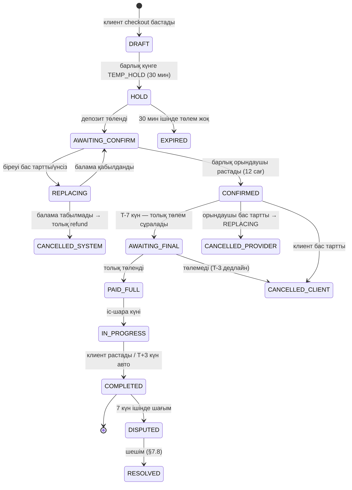
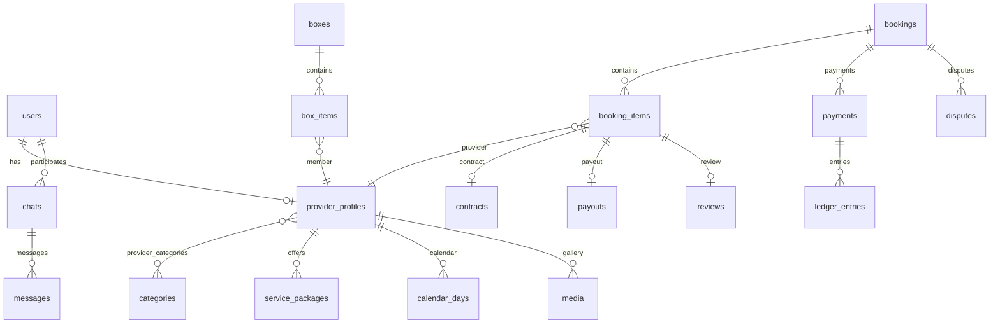
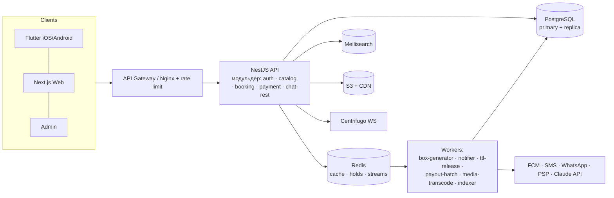
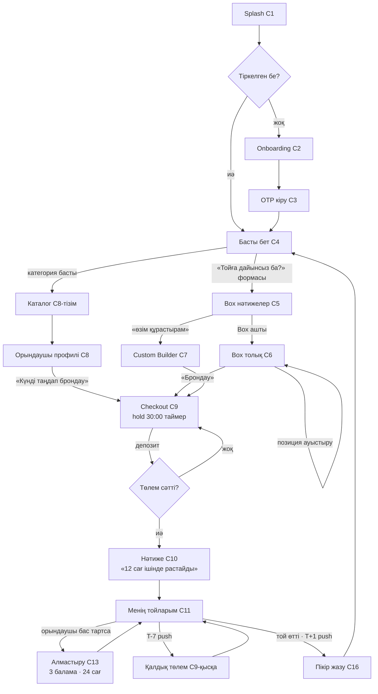
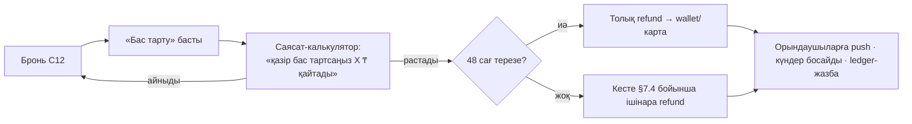
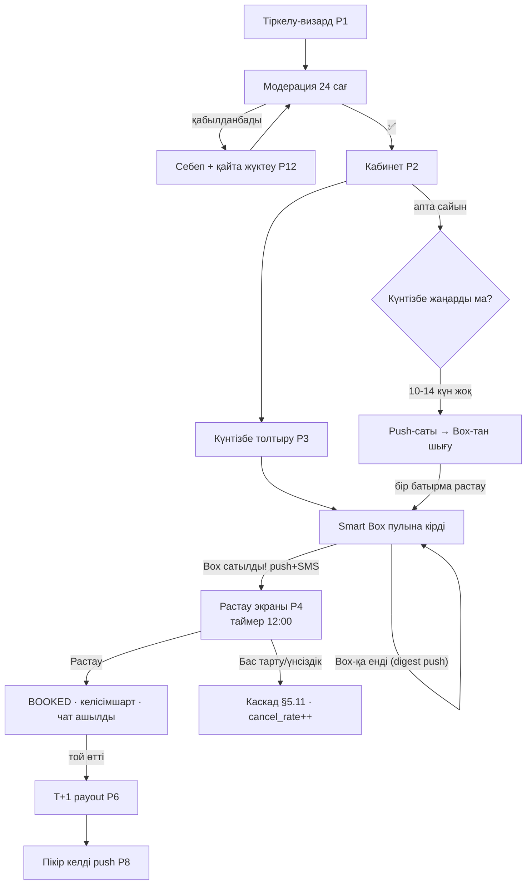
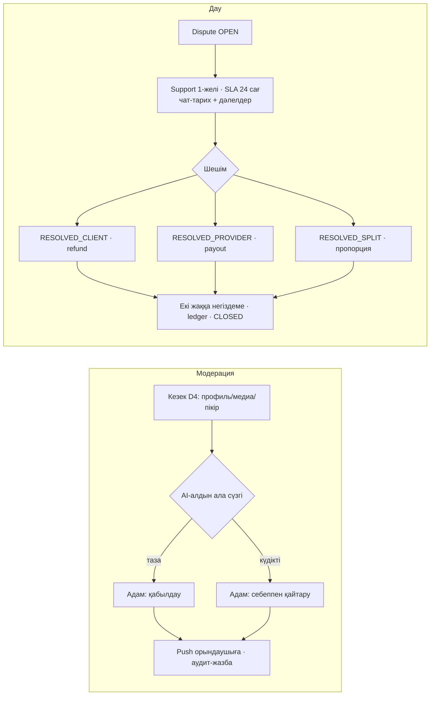
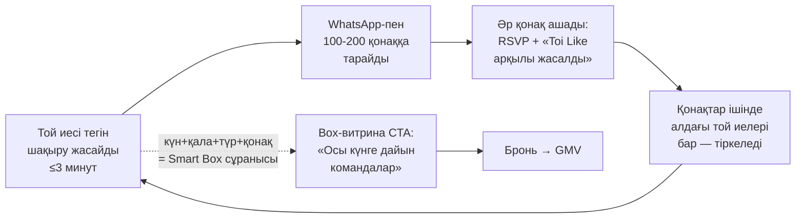

# TOI LIKE — Өнім талаптары құжаты (PRD)

**Нұсқа:** 1.2 · **Мәртебе:** Әзірлеуге дайын · **Тіл:** қазақша (техникалық идентификаторлар — ағылшынша)
**Иесі:** Абдильдин Даурен · **Құжат түрі:** толық PRD + техникалық спецификация
**Қамту:** бизнес-модель, рөлдер, Smart Box алгоритмі, күнтізбе, бронь, төлем, хабарлама, пікір, іздеу, чат, AI, дерекқор, API, архитектура, қауіпсіздік, UX/UI, аналитика, тәуекелдер, жол картасы

---

## Мазмұны

1. [Executive Summary](#1-executive-summary)
2. [Нарық және бизнес-модель](#2-нарық-және-бизнес-модель)
3. [Пайдаланушы рөлдері және рұқсаттар](#3-пайдаланушы-рөлдері-және-рұқсаттар)
4. [Домендік модель (негізгі ұғымдар)](#4-домендік-модель)
5. [SMART BOX жүйесі — платформаның ядросы](#5-smart-box-жүйесі)
6. [Күнтізбе жүйесі](#6-күнтізбе-жүйесі)
7. [Бронь жүйесі (Booking State Machine)](#7-бронь-жүйесі)
8. [Төлем жүйесі](#8-төлем-жүйесі)
9. [Хабарламалар жүйесі](#9-хабарламалар-жүйесі)
10. [Пікір және рейтинг](#10-пікір-және-рейтинг)
11. [Іздеу](#11-іздеу)
12. [Чат](#12-чат)
13. [AI мүмкіндіктері](#13-ai-мүмкіндіктері)
14. [Дерекқор дизайны](#14-дерекқор-дизайны)
15. [API дизайны](#15-api-дизайны)
16. [Архитектура, tech stack, масштабтау](#16-архитектура)
17. [Қауіпсіздік](#17-қауіпсіздік)
18. [UX/UI — барлық экрандар](#18-uxui)
19. [Аналитика және метрикалар](#19-аналитика)
20. [Яндекс Такси / inDrive тәжірибесінен алынған инженерлік шешімдер](#20-инженерлік-сабақтар)
21. [Болжамды мәселелер және шешімдері (Risk Register)](#21-risk-register)
22. [Жол картасы: MVP → V2 → V3 → Болашақ](#22-жол-картасы)
23. [Ашық сұрақтар](#23-ашық-сұрақтар)
24. [UX Flow — рөл бойынша ағын-карталар](#24-ux-flow)
25. [Business Logic — критикалық әрекеттер](#25-business-logic)
26. [QA тест-жоспары (ядро-сценарийлер)](#26-qa-тест-жоспары)
27. [UI Design System](#27-ui-design-system)
28. [Өсу циклі: тегін шақыру-қозғалтқыш](#28-өсу-циклі)

---

# 1. EXECUTIVE SUMMARY

## 1.1 Проблема

Қазақстанда той — үлкен индустрия, бірақ ол **толық цифрланбаған**:

- Той ұйымдастырушы (клиент) тамада, әнші, DJ, фотограф, видеограф, би тобы, безендіруші, торт, ресторан, көлік — **10-15 бөлек орындаушыны** Instagram, WhatsApp және таныстар арқылы **аптап-айлап** іздейді.
- Әр орындаушымен жеке жазысу, бағасын сұрау, бос күнін нақтылау — орта есеппен **50-100 хабарлама, 2-4 апта уақыт**.
- Ең ауыр жері: **бәрінің ДӘЛ СОЛ БІР КҮНІ бос болуын** үйлестіру. Бір адам бос болмаса — тізбек қайта басталады.
- Орындаушы жағында: тапсырыс ағыны тұрақсыз, маусым тыс уақытта бос отырады, Instagram-да жарнамаға ақша шашады, күнтізбесін дәптерде жүргізеді.
- Алдын ала төлем алаяқтығы (екі жаққа да), келісімшарттың жоқтығы, дау шешу тетігінің жоқтығы.

## 1.2 Шешім

**Toi Like** — той/іс-шара индустриясының AI-негізді маркетплейсі. Басты айырмашылық — бұл **каталог емес**:

> Клиент күнді, қаланы, бюджетті, қонақ санын енгізеді → жүйе әр орындаушының күнтізбесін тексеріп, **тек сол күні нақты бос** орындаушылардан **сатып алуға дайын толық той командаларын (Smart Box)** автоматты құрастырып береді: Economy-ден Exclusive-ке дейін.

3 минутта клиент қолында: тамада + DJ + фотограф + видеограф + әнші + би тобы — бәрі бос, бәрі бір бағамен, бір батырмамен брондалады, келісімшарт автоматты жасалады, төлем қорғалған.

## 1.3 Неге дәл біз

- Smart Box — мәні бойынша **шектеулерді қанағаттандыру есебі** (constraint satisfaction): «осы күні, осы қалада, осы бюджетте — кім бос, кім үйлеседі». Команда бұл алгоритм класын **RASPIS** (мектеп кестесін құру қозғалтқышы, өндірісте) арқылы дәлелдеп шыққан: greedy + repair + көп-нұсқа іріктеу + hold/rollback механикасы — дәл сол ДНҚ.
- Жергілікті контекст: қазақ тілі, Kaspi төлем мәдениеті, WhatsApp-first коммуникация, той түрлерінің ерекшелігі (үйлену, беташар, сүндет, мерейтой, құдалық).

## 1.4 Нарық (болжам, тексеруді қажет етеді)

| Көрсеткіш | Болжам | Дереккөз/логика |
|---|---|---|
| ҚР-дағы жылдық неке саны | ~120-140 мың | ҰСБ статистикасы (тексеру керек) |
| Барлық той-жиын түрлері (үйлену+беташар+сүндет+мерейтой+құдалық+бітіру) | жылына 400-600 мың іс-шара | 1 некеге орта есеппен 3-4 ілеспе іс-шара |
| Орташа қызмет-чек (ресторансыз) | 800 мың – 2,5 млн ₸ | нарық сұхбаттары керек |
| Қызмет нарығының көлемі (TAM) | **жылына ~400-800 млрд ₸** | консервативті есеп |
| Платформа айналымының 3-жылдық мақсаты (GMV) | 4-8 млрд ₸ (нарықтың ~1%) | |
| Комиссиялық табыс (8%) | 320-640 млн ₸/жыл | + жазылым/жарнама |

Кеңею: Қырғызстан, Өзбекстан, Тәжікстан — той мәдениеті ұқсас, бәсеке цифрлық жағынан әлсіз.

## 1.5 Табыс көздері (қысқаша)

1. Әр броньнан комиссия (базалық **8%**);
2. Орындаушының Premium жазылымы;
3. Featured (көтерілген) профильдер;
4. Ресторан/шоу-компаниялардың промо-парақтары;
5. AI Pro жазылым (клиентке);
6. Корпоративтік аккаунттар (event-агенттіктер, БТ бөлімдері).

## 1.6 Табыс формуласы (North Star)

**North Star Metric = аптасына сәтті өткен брондалған іс-шара саны (Completed Events / Week).**
Барлық өнімдік шешім осы метриканы өсіруге бағынады.

---

# 2. НАРЫҚ ЖӘНЕ БИЗНЕС-МОДЕЛЬ

## 2.1 Екі жақты маркетплейс экономикасы

```
Клиент ──── іздейді, брондайды, төлейді ────▶ TOI LIKE ──── тапсырыс, төлем (−комиссия) ────▶ Орындаушы
   ▲                                             │
   └───── кепілдік, келісімшарт, алмастыру ◀─────┘
```

Платформа құны **екі жаққа да** матчингтен әлдеқайда артық болуы керек (әйтпесе олар бізді айналып өтеді — §20.4):

| Клиентке құндылық | Орындаушыға құндылық |
|---|---|
| 3 минутта дайын команда | Тұрақты тапсырыс ағыны |
| Расталған пікірлер, рейтинг | Кәсіби профиль (сайты жоқтарға — сайт) |
| Төлем қорғанысы (escrow) | Төлем кепілдігі, алдын ала төлем |
| Автоматты келісімшарт | Автоматты келісімшарт + дау қорғанысы |
| Орындаушы бас тартса — авто-алмастыру | Бас тартқан клиенттен өтемақы |
| AI жоспарлаушы, смета | Аналитика, баға кеңесі, күнтізбе |

## 2.2 Комиссия логикасы

| Параметр | Мәні | Түсінік |
|---|---|---|
| Базалық комиссия | **8%** | Броннің жалпы сомасынан |
| Premium орындаушы | **6%** | Жазылым төлегендерге ынталандыру |
| Founding Provider (алғашқы қалалық 100 орындаушы) | **0%** алғашқы 6 ай | Қала іске қосу тактикасы (§20.2) |
| Ресторан категориясы | **4%** | Чегі үлкен, маржасы төмен категория |
| Комиссия кімнен | Орындаушыдан (payout кезінде шегеріледі) | Клиент көрген баға = түпкі баға |

**Шешім:** орындаушы платформада **клиент көретін (gross) бағасын** қояды; комиссия төлем бөлінген кезде шегеріледі. Бұл клиентке «жасырын үстеме жоқ» сенімін береді (inDrive сабағы: баға ашықтығы — сенім негізі).

## 2.3 Premium жазылым (орындаушыға)

| Тариф | Баға (болжам) | Артықшылықтар |
|---|---|---|
| Basic | 0 ₸ | Профиль, күнтізбе, бронь, чат |
| Premium | 9 900 ₸/ай немесе 79 900 ₸/жыл | Іздеуде көтерілу, Verified жанындағы Premium белгісі, Smart Box скорингінде +бонус (шектеулі, §5.4), толық аналитика, комиссия 8%→6%, бәсекелес-бағалар талдауы |
| Premium+ (V2) | 24 900 ₸/ай | + Featured орын (кезекпен), + AI Smart Pricing, + жеке менеджер |

**Маңызды шектеу:** Premium скоринг-бонусы **сапа сүзгісінен өткеннен кейін ғана** әсер етеді — ақшамен нашар сапаны жоғары шығаруға болмайды (әйтпесе клиент сенімі өледі → бүкіл маркетплейс өледі).

## 2.4 Unit-экономика (бір бронь, орташа сценарий)

| Бап | Сома |
|---|---|
| Орташа Box чегі (Premium tier, қызметтер) | 1 400 000 ₸ |
| Платформа комиссиясы (8%) | 112 000 ₸ |
| Төлем жүйесінің комиссиясы (~2%) | −28 000 ₸ |
| SMS/push/инфраструктура/бронь | −800 ₸ |
| Дау/өтемақы резерві (2%) | −2 240 ₸ |
| **Үлес маржа (contribution margin)** | **~80 960 ₸ (~72%)** |
| CAC мақсаты (клиент тарту құны) | ≤ 25 000 ₸ |

## 2.5 Той маусымдылығы (жоспарлауға кіреді)

- Шың: **сәуір–маусым**, **тамыз–қараша** (сенбі күндері — гипер-шың).
- Ойпат: қаңтар–наурыз, шілде (шілде — демалыс), Рамазан кезеңі (аймаққа қарай).
- Өнімдік жауап: ойпат-күн жеңілдіктері («Бейсенбі тойы −15%»), шың-күнде тапшылық индикаторы («бұл күнге орындаушылардың 68%-ы бос емес») — §20.6.

---

# 3. ПАЙДАЛАНУШЫ РӨЛДЕРІ ЖӘНЕ РҰҚСАТТАР

## 3.1 Рөлдер

| Рөл | Сипаттама |
|---|---|
| `guest` | Тіркелмеген қонақ — көру, іздеу, Box көру (бронь жоқ) |
| `client` | Той ұйымдастырушы |
| `provider` | Орындаушы (тамада, әнші, DJ, ...) — бір адамда client+provider рөлі қатар бола алады |
| `provider_team` | Орындаушы командасының мүшесі (V2: студия аккаунтындағы қосымша адам) |
| `moderator` | Контент/пікір/құжат модерациясы |
| `support` | Қолдау қызметі — чат, дау бірінші желісі |
| `finance_admin` | Төлем, payout, қайтарым операциялары |
| `super_admin` | Толық қол жеткізу, конфигурация, комиссиялар |

## 3.2 Рұқсат матрицасы (қысқартылған RBAC)

| Әрекет | guest | client | provider | moderator | support | finance | super |
|---|---|---|---|---|---|---|---|
| Профильдер/Box көру | ✅ | ✅ | ✅ | ✅ | ✅ | ✅ | ✅ |
| Бронь жасау | ❌ | ✅ | ✅(клиент рөлінде) | ❌ | ❌ | ❌ | ✅ |
| Күнтізбе/баға өңдеу | ❌ | ❌ | ✅(өзінікі) | ❌ | ❌ | ❌ | ✅ |
| Пікір жазу | ❌ | ✅(тек өткен бронь) | ✅(клиентке, V2) | ❌ | ❌ | ❌ | ✅ |
| Пікір/құжат модерация | ❌ | ❌ | ❌ | ✅ | ❌ | ❌ | ✅ |
| Дау шешу | ❌ | қатысушы | қатысушы | ұсыныс | ✅ 1-желі | ✅ шешім | ✅ |
| Payout/refund жүргізу | ❌ | ❌ | ❌ | ❌ | ❌ | ✅ | ✅ |
| Комиссия/конфиг өзгерту | ❌ | ❌ | ❌ | ❌ | ❌ | ❌ | ✅ |
| Пайдаланушыны бұғаттау | ❌ | ❌ | ❌ | ұсыныс | ұсыныс | ❌ | ✅ |

Барлық админ әрекеті `audit_logs`-қа жазылады (§14, §17).

## 3.3 Орындаушы категориялары (іске қосу тізімі)

`categories` анықтамалығы, админ басқарады, әр қалада жеке қосылады:

| # | slug | Атауы | MVP |
|---|---|---|---|
| 1 | tamada | Тамада / жүргізуші | ✅ |
| 2 | singer | Әнші | ✅ |
| 3 | dj | DJ | ✅ |
| 4 | photographer | Фотограф | ✅ |
| 5 | videographer | Видеограф | ✅ |
| 6 | dance_group | Би тобы | ✅ |
| 7 | show | Шоу-бағдарлама | V1.1 |
| 8 | led_show | LED / от шоу | V1.1 |
| 9 | decorator | Безендіруші | V1.1 |
| 10 | cake | Торт / кондитер | V1.1 |
| 11 | restaurant | Ресторан / той залы | V2 |
| 12 | car | Көлік / кортеж | V1.1 |
| 13 | makeup | Визажист | V1.1 |
| 14 | dress | Көйлек/киім жалдау | V2 |
| 15 | invitation | Шақыру дизайны | V2 |
| 16 | flowers | Гүл | V2 |
| 17 | sound | Дыбыс аппаратурасы | V1.1 |
| 18 | light | Жарық | V1.1 |
| 19 | live_band | Тірі оркестр/музыкант | V1.1 |
| 20 | event_agency | Толық агенттік | V2 |

## 3.4 Іс-шара түрлері

`event_types`: `wedding` (үйлену), `betashar` (беташар), `sundet` (сүндет той), `anniversary` (мерейтой), `kudalyk` (құдалық), `graduation` (бітіру кеші), `corporate` (корпоратив, V2), `birthday` (туған күн, V2), `conference` (V3). Әр түрдің өз Box-құрам шаблоны бар (§5.5).

---

# 4. ДОМЕНДІК МОДЕЛЬ

Негізгі ұғымдар (барлық бөлімде бірдей мағынада қолданылады):

| Ұғым | Анықтама |
|---|---|
| **Provider** | Орындаушы профилі. Бір user бірнеше категорияда болуы мүмкін (тамада әрі әнші) |
| **Service Package** | Орындаушының нақты ұсынысы: «Толық той жүргізу, 6 сағат, 350 000 ₸» — атауы, құрамы, бағасы, ұзақтығы |
| **Calendar Day** | Орындаушының нақты күндегі күйі (бос/бронь/hold/…) — §6 |
| **Smart Box** | Нақты (күн, қала, іс-шара түрі, бюджет-деңгей) үшін жүйе құрастырған орындаушылар жиынтығы + жалпы баға |
| **Box Tier** | Box деңгейі: Economy, Classic, Premium, VIP, Luxury, Royal, Exclusive |
| **Custom Box** | Клиент LEGO-ша өзі құрастырған жиынтық — жүйе тек үйлесімділік пен бос болуын тексереді |
| **Booking** | Бронь — бір іс-шараға бір немесе бірнеше орындаушыны бекіту. Box сатып алу = көп-элементті Booking |
| **Booking Item** | Бронь ішіндегі бір орындаушы-позиция (өз күй машинасы бар) |
| **Hold (TTL)** | Уақытша ұстау: checkout кезінде орындаушы күні N минутқа қорғалады — §5.10 |
| **Contract** | Автогенерацияланатын келісімшарт (PDF) — бронь расталғанда жасалады |
| **Ledger** | Қос жазбалы қаржы кітабы: барлық ақша қозғалысының бірыңғай ақиқат көзі — §8.6 |
| **Payout** | Той өткеннен кейін орындаушыға төленетін сома (комиссия шегерілген) |
| **Dispute** | Клиент пен орындаушы арасындағы дау — өз процесі бар — §7.8 |
| **Replacement Offer** | Орындаушы бас тартқанда жүйе ұсынатын алмастыру — §5.11 |

Күй машиналарының қысқаша картасы (толығы тиісті бөлімдерде):

```
CalendarDay: AVAILABLE → TEMP_HOLD → BOOKED          (§6)
Box:         GENERATED → CHECKOUT_HOLD → SOLD        (§5.13)
Booking:     DRAFT → … → COMPLETED                   (§7.2)
Payment:     PENDING → CAPTURED → (REFUNDED)         (§8.4)
Payout:      SCHEDULED → PAID                        (§8.5)
Dispute:     OPEN → RESOLVED_*                       (§7.8)
```

---

# 5. SMART BOX ЖҮЙЕСІ

> Платформаның жүрегі. Каталогтан айырмашылық осында: жүйе клиент үшін **дайын, сатып алуға болатын, сол күні нақты бос** той командаларын өзі құрастырады. Инженерлік тұрғыда бұл — Яндекс Таксидің диспетчинг есебінің (сұраныс ↔ бос жүргізуші матчингі) той индустриясына көшірілген, көп-позициялы нұсқасы + RASPIS-тің кесте-құрастыру ДНҚ-сы (шектеу-сүзгі → скоринг → greedy құрастыру → repair → көп-нұсқа іріктеу → hold/rollback).

## 5.1 Шолу (ағын)

```
Клиент: күн + қала + іс-шара түрі + бюджет + қонақ саны
        │
        ▼
┌─ 1. КАНДИДАТ СҮЗГІСІ (hard constraints) ── әр категория бойынша бос орындаушылар пулы
│
├─ 2. СКОРИНГ ── әр кандидатқа 0-100 балл (рейтинг, баға, қашықтық, жауап жылдамдығы…)
│
├─ 3. БЮДЖЕТ ҮЛЕСТІРУ ── деңгей (tier) бойынша категорияларға бюджет конверттері
│
├─ 4. ҚҰРАСТЫРУ ── greedy (үздіктен) + repair (сыймаса алмастыру) + әртүрлілік ережелері
│
├─ 5. КОНФЛИКТ ТЕКСЕРУ ── бір адам екі рөлде, жол уақыты, студия-байланыс, эксклюзив
│
├─ 6. N НҰСҚА ── әр tier-ге 1 негізгі + 2 балама Box (seed-әртараптандыру)
│
▼
Клиентке: Economy → Exclusive витринасы. Әр Box: құрам, фото, рейтинг, баға, «бәрі осы күні бос» кепілі
```

## 5.2 Кіріс параметрлері

| Параметр | Міндетті | Ескерту |
|---|---|---|
| `event_date` | ✅ | Бір күн; V2 — диапазон («тамыздың кез келген сенбісі») |
| `city_id` | ✅ | + `travel_radius_km` опциясы (көрші қала орындаушылары) |
| `event_type` | ✅ | wedding / betashar / sundet / anniversary / kudalyk / graduation |
| `budget_total` | ⭕ | Берілмесе — барлық tier көрсетіледі |
| `guests_count` | ⭕ | Ресторан сыйымдылығына және кейбір бағаларға әсер етеді |
| `language_pref` | ⭕ | qaz / rus / аралас — тамада/әншіге қатты сүзгі бола алады |
| `must_have` | ⭕ | «Осы фотограф міндетті болсын» — pin |
| `exclude` | ⭕ | «Мына орындаушысыз» |

## 5.3 Кандидат сүзгісі — HARD CONSTRAINTS (бұзылмайды)

Әр категория үшін пул: (индекстелген бір SQL + Redis кэш, мақсат ≤50ms/категория)

1. `provider.status = ACTIVE` және `verification = APPROVED`;
2. `category` сәйкес және сол қалада қызмет көрсетеді (`provider_cities`, немесе `travel_ok=true` әрі қашықтық ≤ радиус);
3. **Күнтізбе:** `calendar_days[event_date].status = AVAILABLE` (TEMP_HOLD/BOOKED/BUSY/VACATION → шығады);
4. **Күнтізбе балғындығы:** `calendar_verified_at ≥ NOW() − 14 күн` (ескірсе Smart Box-тан ШЫҒАДЫ — §6.4; іздеуде қалады, бірақ «күнтізбе ескірген» белгісімен);
5. `min_price ≤ категория конверті × 1.15` (мүлде сыймайтындар кірмейді);
6. Тіл талабы қойылса — сәйкестік;
7. `cancellation_rate ≤ 15%` соңғы 90 күнде (жоғары болса — тек Economy-ге де кірмейді, карантин — §20.5);
8. Бір іс-шара түріне жарамдылық (сүндет тойға 18+ шоу ұсынылмайды — категория флагтары).

## 5.4 Скоринг формуласы

Әр кандидатқа: `score = Σ (салмақ × нормаланған фактор) − айыппұлдар`, 0-100 шкала.

| Фактор | Салмақ | Есептеу |
|---|---|---|
| Рейтинг (Bayesian, §10.2) | **25** | `(R − 3.5) / 1.5` кесіліп 0-1 аралығына |
| Пікір көлемі | **8** | `log10(1 + reviews) / log10(1 + 200)` |
| Баға сәйкестігі конвертке | **20** | 1 − міндетті емес ауытқу: конверт ортасына жақындық (тым қымбат ТА тым арзан да төмендейді — арзандық сапа-сигнал) |
| Қашықтық / қала | **8** | Өз қала = 1.0; әр 50 км −0.2 |
| Жауап көрсеткіші (response rate ×, median response time) | **10** | 1 сағат ішінде жауап = 1.0; >24 сағ = 0 |
| Қабылдау көрсеткіші (acceptance rate) | **6** | Расталған / ұсынылған бронь |
| Тәжірибе | **8** | `log`(өткізген той саны) + жыл саны, 0-1 |
| Толық профиль (фото ≥10, видео ≥1, портфолио) | **5** | Чек-лист пайызы |
| Premium жазылым | **+5 (қатаң қақпақ)** | ТЕК тең сапада көтереді; сапа сүзгісінен өткеннен кейін қосылады |
| Жаңа орындаушы exploration-бусты | **+5 дейін** | Алғашқы 90 күн / алғашқы 10 бронь — суық старт мәселесін шешу (§20.7) |
| **Айыппұлдар** | | |
| Cancellation rate (90 күн) | −(rate × 40) | 10% бас тарту = −4 |
| Күнтізбе 7-14 күн жаңармаған | −5 | 14+ күн = пулдан шығу (hard) |
| Айналып өту күдігі (§17.6) | −15 | Дау расталса — тоқтату |
| Соңғы 30 күндегі шағым | −5/шағым | Модерация растаған болса |

Салмақтар `config`-та (админ өзгерте алады, A/B тестке дайын). Барлық өзгеріс журналда.

## 5.5 Бюджет үлестіру матрицасы

### 5.5.1 Tier-анықтау (қала коэффициентімен)

Базалық шкала (Семей, қызметтер, ресторансыз; Алматы/Астана ×1.6, облыс орталығы ×1.2):

| Tier | Бюджет диапазоны | Құрам (wedding) |
|---|---|---|
| Economy | 250 – 600 мың ₸ | тамада+DJ (2) |
| Classic | 600 мың – 1,2 млн | + фотограф (3) |
| Premium | 1,2 – 2 млн | + видеограф, әнші (5) |
| VIP | 2 – 3,5 млн | + би тобы, безендіру (7) |
| Luxury | 3,5 – 6 млн | + шоу, LED, торт (10) |
| Royal | 6 – 10 млн | + 2-әнші, кортеж, визажист (13) |
| Exclusive | 10 млн + | бәрі + жеке куратор (адам!) + сирек жұлдыз-орындаушылар |

Диапазондар статикалық емес: әр қала бойынша **нақты бағалардың перцентильдерінен** тоқсан сайын қайта есептеледі (P10-P25 = Economy...). Іс-шара түріне қарай құрам-шаблон өзгереді (беташарға би тобы міндетті емес, сүндетке аниматор қосылады) — `box_templates` кестесі.

### 5.5.2 Категория конверттері

Мысал: Premium (wedding), бюджет 1 600 000 ₸:

| Категория | Үлес | Конверт | Икемділік |
|---|---|---|---|
| Тамада | 28% | 448 000 | ±20% |
| Әнші | 18% | 288 000 | ±25% |
| Фотограф | 17% | 272 000 | ±20% |
| Видеограф | 17% | 272 000 | ±20% |
| DJ | 12% | 192 000 | ±25% |
| Резерв (repair-ге) | 8% | 128 000 | — |

Резерв — RASPIS сабағы: қатаң конверттер құрастыруды жиі құлатады; 8% «еркіндік қоры» repair-қадамға мүмкіндік береді.

## 5.6 Құрастыру алгоритмі (pseudo-code)

```
function generateBoxes(query):
    pools = {cat: filterCandidates(cat, query) for cat in template(query.event_type, tier)}
    for tier in tiers_within(query.budget):
        for seed in [0, 1, 2]:                      # 3 нұсқа: негізгі + 2 балама
            box = []
            for cat in template.categories_by_priority:  # тапшы категория бірінші
                ranked = rank(pools[cat], score, seed)   # seed>0 → шудың аз қосылуы (әртүрлілік)
                pick = first(ranked, p =>
                          fits_envelope(p, cat)
                       && no_conflict(box, p)            # §5.7
                       && diversity_ok(p, shown_boxes))  # §5.8
                if pick: box.add(pick)
                else:    box.add(best_effort(ranked))    # конвертке сыймаса — резервтен
            box = repair(box, budget_total)              # қымбат позицияны арзанырақ баламамен
                                                         # алмастырып жалпы бюджетке сыйдыру
            if valid(box): emit(box, tier, seed)
    return dedupe_and_rank(emitted)
```

- **Тапшылық басымдығы:** пул көлемі ең аз категория (мыс. сол күні 2-ақ би тобы бос) бірінші таңдалады — RASPIS-тегі «қиын пәнді бірінші орналастыру» қағидасы.
- **Repair:** жалпы сома tier төбесінен асса — «ең аз score/₸ пайдалы» позицияны келесі арзанырақ кандидатпен алмастырады (max 3 итерация), сыймаса Box жарамсыз.
- **Best_effort:** категорияда ешкім қалмаса Box сол позициясыз шықпайды → «Бұл күнге VIP-тен жоғары Box құрастырылмады: би топтары бос емес» деген адал хабармен төменгі tier ұсынылады.

## 5.7 Конфликт детекциясы

| Конфликт | Тексеру | Шешім |
|---|---|---|
| Бір адам екі категорияда (тамада әрі әнші) | `user_id` бірегейлігі Box ішінде | Рұқсат ТЕК «комбо-пакет» ретінде: бір адам, екі рөл, жеңілдікті баға; әйтпесе екінші рөлге басқа адам |
| Бір күнде екі іс-шара (өз қаласында таңгы+кешкі) | `calendar_day.slots` (V2: күн ішіндегі таңертең/кеш слоттары) | MVP: 1 күн = 1 той (қатаң); V2: слоттар + арадағы жол уақыты ≥ 3 сағ |
| Көрші қаладағы алдыңғы күн кешкі той → таңғы жол | Алдыңғы/келесі күн броні басқа қалада ма | `travel_buffer`: қашықтық > 200 км болса іргелес күн еркін болуы керек |
| Фото+видео бір студиядан | `studio_group_id` | Керісінше — БОНУС +3 (үйлесімді жұмыс), бір студиядан екеуін таңдау басым |
| Эксклюзив тежеу (әнші X тек Y ресторанында жұмыс істемейді т.б.) | `provider_blacklist` жұптары | Box-та қатар болмайды |
| Жабдық қақтығысы (DJ өз аппаратурасынсыз + дыбыс жоқ) | `requires`/`provides` флагтары | Box-та `sound` жабылмаса ескерту/автоқосу |

## 5.8 Әртүрлілік және суық старт

- Бір орындаушы бір сұраныстың көрсетілген Box-тарының **ең көбі 2-еуінде** тұрады (әйтпесе бәрінде бір тамада шығып, таңдау иллюзиясы жоғалады).
- Топ-орындаушы монополиясын шектеу: аптасына бір орындаушыға көрсетілім-үлес қақпағы (impression cap) — жаңалар да көрінеді.
- Жаңа орындаушы exploration-бусты (§5.4) + «Жаңа, бірақ тексерілген» белгісі. Яндекс сабағы: жаңа жүргізушіге алғашқы тапсырыстарды бермесең — ол кетеді, supply өледі.

## 5.9 Кэштеу және инвалидация

| Механизм | Сипаттама |
|---|---|
| Кэш кілті | `(city, date, event_type, guests_bucket, budget_bucket, filters_hash)` → Redis, TTL 6 сағат |
| Оқиға-инвалидация | Күнтізбе өзгерісі / баға өзгерісі / жаңа бронь → `calendar.changed{provider, date}` оқиғасы → сол (city, date) кэштері өшеді (event-driven, Kafka/Redis Streams) |
| Витрина алдын ала есептеу | Түнгі job: топ-қалалар × алдағы 26 демалыс күні → SEO-беттер («Семейде 15 тамызға дайын той пакеттері») + бас бет блоктары |
| Rate limit | Бір клиент сұранысына генерация ≤ 1/10 сек; ауыр құрастыру фондық жұмысшыда (queue) |

## 5.10 Hold / TTL механикасы (Яндекс Такси үлгісі)

Таксидегі «жүргізушіге offer — 15 секунд» механикасының той-нұсқасы:

| Кезең | Не ұсталады | TTL | Босату |
|---|---|---|---|
| Box көру | ЕШТЕҢЕ (көру — hold емес!) | — | — |
| Checkout басталды («Брондау» басылды) | Box-тағы әр орындаушының сол күні → `TEMP_HOLD` | **30 минут** | Төлемсіз TTL бітсе — авто-AVAILABLE + клиентке «уақыт бітті» |
| Депозит төленді | `TEMP_HOLD` ұзарады | Растау терезесі: **12 сағат** | Әр орындаушы «Растау/Бас тарту» |
| Орындаушы растады | Оның позициясы → `BOOKED` | — | — |
| Орындаушы бас тартты / үнсіз | → Алмастыру каскады §5.11 | — | — |

Бір күнге бір орындаушыға **бір ғана белсенді hold** (бәсекелес checkout келсе — «бұл орындаушыны қазір басқа біреу брондап жатыр, 28 мин күтіңіз немесе баламасын таңдаңыз» — Booking.com тапшылық-үлгісі, бірақ ШЫНАЙЫ, жасанды емес).

## 5.11 Автоматты алмастыру каскады

Орындаушы бас тартқанда (немесе 12 сағ үнсіз қалғанда):

```
1. Сол категория пулынан келесі кандидаттар: score ≥ 0.9 × бастапқы, баға ≤ 1.10 × конверт
2. Клиент режиміне қарай:
   ├─ AUTO (келісімде белгілеген): үздік балама авто-қосылады, баға айырмасы:
   │    арзанырақ → айырма қайтарылады; қымбатырақ ≤5% → платформа жабады (retention шығыны);
   │    >5% → клиент растауына түседі
   └─ MANUAL: клиентке push + 3 балама карточка, 24 сағат таңдау терезесі
3. Бас тартқан орындаушыға: cancellation_rate++, рейтинг-салдары (§10.5),
   T-14 күннен жақын бас тартса — айыппұл (депозиттен өтемақы клиентке купон түрінде)
4. Ешкім табылмаса: support-қа эскалация (адам іздейді) + клиентке толық қайтарым опциясы
```

Бұл — таксидегі «жүргізуші бас тартты → қайта диспетчинг» ағыны; клиент ешқашан «бос қалмайды».

## 5.12 Box хабарлама ағыны

| Оқиға | Кімге | Арна | Мәтін үлгісі |
|---|---|---|---|
| Box-қа енгізілді | Орындаушы | Push (күніне digest, max 3) | «Сіз 15.08 Семейдегі Premium Box құрамына ендіңіз 🎉» |
| Box-тан шығарылды (күнтізбе ескірді) | Орындаушы | Push + in-app | «Күнтізбеңіз 14 күн жаңармады — Box-тардан шығарылдыңыз. Бір батырмамен растаңыз» |
| Checkout басталды (hold) | Әр мүше | Push (instant) | «Сіздің 15.08 күніңізге бронь рәсімделуде — 30 мин ұсталды» |
| Box сатылды (депозит түсті) | Әр мүше | Push + SMS | «Құттықтаймыз! Premium Box сатылды. 12 сағат ішінде растаңыз» |
| Барлығы растады | Клиент | Push + WhatsApp | «Той командаңыз толық расталды ✅ Келісімшарттар қолжетімді» |
| Мүше бас тартты | Клиент | Push | «Өкінішке қарай DJ бас тартты — 3 балама дайын» |

## 5.13 Box күй машинасы

```
GENERATED ──(клиент ашты)──▶ VIEWED ──(«Брондау»)──▶ CHECKOUT_HOLD(30мин)
   │                                                     │
   │ (кэш TTL/күнтізбе өзгерді)                          ├─(депозит)─▶ SOLD → Booking жасалады (§7)
   ▼                                                     └─(TTL бітті)─▶ EXPIRED → күндер босайды
INVALIDATED (қайта генерацияда жаңарады)
```

## 5.14 Custom Box Builder (LEGO режимі)

Клиент өзі құрастырады; жүйе тек көмектеседі:

1. Категория таңдайды → сол күні бос орындаушылар тізімі (сол скорингпен сұрыпталған);
2. Әр қосқанда: жалпы баға жаңарады, конфликт тексеріледі (§5.7), «үйлесімділік кеңесі» шығады («Бұл фотографпен жиі жұмыс істейтін видеограф — X»);
3. Кемінде 1 позициядан бастап брондай алады (жалғыз тамада да — Booking);
4. Жартылай құрастырып «AI толықтырсын» батырмасы → қалғанын Smart Box алгоритмі толтырады;
5. Сақталған Custom Box — «Менің жобам»: бөлісуге болатын сілтеме (WhatsApp-қа жіберіп, жұбайымен талқылайды — вирусдық тетік).

---

# 6. КҮНТІЗБЕ ЖҮЙЕСІ

> Күнтізбе — маркетплейстің «жүрек соғысы». Такси-сабақ: жүргізушінің «онлайн/офлайн» дәлдігі қандай маңызды болса, орындаушы күнтізбесінің актуалдығы сондай. Ескірген күнтізбе = сатылмайтын Box = өлі маркетплейс.

## 6.1 Күн статустары (`calendar_days.status`)

| Статус | Кім қояды | Smart Box-қа әсері | Түсі (UI) |
|---|---|---|---|
| `AVAILABLE` | Әдепкі / орындаушы | Кіреді | 🟢 |
| `TEMP_HOLD` | Жүйе (checkout) | Жабық, `expires_at` дейін | 🟡 |
| `BOOKED` | Жүйе (бронь расталды) | Жабық | 🔵 |
| `BUSY_EXTERNAL` | Орындаушы («платформадан тыс тойым бар») | Жабық | 🔴 |
| `VACATION` | Орындаушы (диапазон) | Жабық | ⚪ |
| `BLOCKED_ADMIN` | Админ (дау/тексеру кезінде) | Жабық | ⚫ |

«Inside Smart Box» — күн статусы ЕМЕС, көрсетілім белгісі (Box-та көріну күнді жаппайды; тек hold/бронь жабады). Бұл маңызды инженерлік шешім: әйтпесе бір көрсетілім бүкіл күнді құлыптап, сатылымды өлтіреді.

## 6.2 Балғындық (freshness) механизмі

- `calendar_verified_at` — орындаушының соңғы растау уақыты.
- Кез келген күнтізбе өзгерісі = растау. Өзгеріс болмаса — апталық «бір батырмалы» push: «Күнтізбеңіз өзекті ме? [Иә, бәрі дұрыс]» — бір тап = жаңарды (мұғалім-жүктеме азайту, Duolingo-үлгі).
- Ескіру шкаласы: 7 күн → скоринг −5; 10, 12, 13-күн → еске салулар; **14 күн → Smart Box пулынан автоматты шығу** (профиль іздеуде қалады, «күнтізбе ескірген» белгісімен); 30 күн → профиль «ұйықтау» режимі (іздеуде төмен).
- Қайта кіру: бір батырмамен растау → бірден пулға оралады (кешіктірусіз — жазаламау, ынталандыру).

## 6.3 Күнтізбе интерфейсі (орындаушы)

- Айлық/апталық/күндік көрініс; ұзақ басу → диапазон бөлектеу → статус қою (bulk).
- Әр күнде: статус түсі + бронь болса клиент аты-события + Box-тарда көрсетілім саны («бұл күнге 4 Box-та тұрсыз»).
- Push арқылы жедел әрекеттер: растау/бас тарту тікелей хабарламадан (iOS/Android action buttons).
- V2: Google Calendar / iCal экспорт-импорт (сыртқы тойларды автосинхрондау).

## 6.4 Синхрондау және жарыс жағдайлары (race conditions)

- Күн жаңарту — **транзакциялық**: `SELECT ... FOR UPDATE` (немесе Redis Redlock) → бір күнге қос бронь физикалық мүмкін емес.
- Hold қою мен төлем — екі фазалы: hold (TTL) → payment webhook → BOOKED. Webhook кешіксе де hold қорғайды; TTL біткен соң төлем келсе → авто-refund + «күн босап қалды, балама таңдаңыз» (Booking.com-ның double-booking қорғанысы).
- Барлық күнтізбе өзгерісі `calendar.changed` оқиғасын шығарады → Box-кэш инвалидациясы (§5.9), «сол күнгі көрсетіліп тұрған Box-тар» қайта тексеріледі.

---

# 7. БРОНЬ ЖҮЙЕСІ

## 7.1 Қағидалар

1. **Бронь = келісімшарт + ақша + күнтізбе** үшеуінің атомдық байланысы. Үшеуінің бірі жоқ бронь — жоқ бронь.
2. Әр `booking_item` (орындаушы-позиция) — өз күй машинасында; `booking` — олардың агрегаты. Box сатып алу = 5-10 item-ді бір бронь.
3. Барлық ауысу — оқиға (event) шығарады → хабарлама, кэш, аналитика соған жазылады (outbox pattern, §16.5).

## 7.2 Booking күй машинасы



## 7.3 Төлем кестесі (payment schedule)

| Кезең | Сома | Қашан | Тағайындалуы |
|---|---|---|---|
| **Депозит** | Бронь сомасының **20%** (мин. 30 000 ₸) | Checkout кезінде, онлайн | Күнді бекітеді; платформа комиссиясы осы бөліктен ұсталады |
| **Қалдық** | 80% | **T-7 күн** (іс-шараға 7 күн қалғанда), онлайн | Escrow-шотта той өткенше сақталады |
| Кеш бронь (T<14 күн) | 100% бірден | Checkout кезінде | |

Ақша ағыны: клиент → платформаның арнайы шоты (escrow-үлгі) → той өткен соң T+1 күні орындаушыға payout (−комиссия). Орындаушы «алдын ала өз қолыма 50% алам» дегенді платформа ІШІНДЕ шеше алмайды — бұл ережеге қарсы емес: V1.1-де «ерте payout» опциясы (депозит бөлігі растаудан кейін T+2 аударылады, тәуекел-скорингпен) — §8.5.

## 7.4 Бас тарту саясаты (cancellation policy)

### Клиент бас тартса

| Уақыт | Депозит | Қалдық |
|---|---|---|
| Растаудан кейін 48 сағ ішінде («салқындау терезесі») | 100% қайтады | — |
| T-30 күннен ерте | 50% қайтады | 100% қайтады |
| T-30 … T-14 | қайтпайды | 100% қайтады |
| T-14 … T-3 | қайтпайды | 50% қайтады (50% орындаушыға өтемақы) |
| T-3 … T-0 | қайтпайды | қайтпайды (100% орындаушыға, −комиссия) |

### Орындаушы бас тартса

| Уақыт | Салдары |
|---|---|
| Кез келген уақытта | Алмастыру каскады (§5.11); клиентке баға айырмасы қорғанысы |
| T-30 күннен ерте | cancellation_rate++, скоринг айыппұлы |
| T-30 … T-14 | + келесі payout-тан айыппұл: бронь сомасының 5%-ы клиентке купон |
| T-14-тен кейін | + айыппұл 10%; 90 күнде 2-рет қайталанса — Smart Box-тан 30 күнге шеттету |
| Той күні келмеді (no-show) | Толық refund клиентке + орындаушыға платформадан шығару процесі + қара тізім |

Форс-мажор (ауру, қаза): анықтамамен — айыппұлсыз, бірақ алмастыру бәрібір іске қосылады. Барлық саясат келісімшартта жазылады.

## 7.5 Онлайн келісімшарт

- Бронь `CONFIRMED` болғанда әр item-ге **PDF келісімшарт автогенерацияланады**: тараптар (клиент ↔ орындаушы; платформа — агент), қызмет құрамы (service package снапшоты), күні/уақыты/мекені, сома, төлем кестесі, бас тарту саясаты, форс-мажор, дау тәртібі.
- Қол қою: SMS-OTP арқылы қарапайым электрондық қолтаңба (ҚР «Электрондық құжат» заңына сәйкес жеңілдетілген нысан; заңгер валидациясы — ашық сұрақ §23).
- Снапшот қағидасы: келісімшартқа кірген баға/құрам **өзгермейді**, орындаушы кейін бағасын көтерсе де (бағаның versioning-і — §14 `service_packages.version`).

## 7.6 «Менің тойларым» (клиент)

Іс-шара хабы: кері санақ («Тойға 43 күн»), команда тізімі (әр мүшенің статусы: расталды/күтілуде), төлем прогресі, келісімшарттар, чат-топ, чек-лист (AI Planner-мен байланысады, §13.1), тайм-лайн (тойдың сценарий-кестесі — V2 тамадамен бірлесіп толтырылады).

## 7.7 Іс-шарадан кейін

- T+1: клиентке «Қалай өтті?» push → пікір жазу терезесі 30 күн (§10).
- T+3: клиент растамаса да `COMPLETED` авто (шағым түспесе). Payout осыдан кейін жүреді.
- T+7 дейін шағым терезесі: `DISPUTED` ашылса — сол item payout-ы `HELD`.

## 7.8 Дау (Dispute) процесі

```
OPEN (клиент/орындаушы ашады, себеп + дәлел: фото/видео/чат-үзінді)
 → UNDER_REVIEW (support 1-желі, SLA 24 сағ; ұсынысы бар)
 → шешім нұсқалары: RESOLVED_CLIENT (толық/ішінара refund)
                    RESOLVED_PROVIDER (payout толық)
                    RESOLVED_SPLIT (пропорция, себеп-кодпен)
 → CLOSED (екі жаққа хабарлама + шешім негіздемесі)
```
- Дау кезінде тиісті payout мұздатылады, қалған item-дер қозғалмайды.
- Дәлел базасы: платформадағы чат тарихы автоматты тіркеледі (офлайн-келісімдер дауын шешу мүмкін емес — тағы бір себеп: коммуникацияны ішінде ұстау).
- 90 күнде 3+ дау ұтылған орындаушы → мәжбүрлі қайта модерация.

---

# 8. ТӨЛЕМ ЖҮЙЕСІ

## 8.1 ҚР төлем ландшафты (нақтылық)

| Арна | Интеграция | Ескерту |
|---|---|---|
| **Kaspi Pay / Kaspi QR** | Партнерлік API (merchant) | ҚР-да іс жүзінде міндетті арна; интеграция шарттары — коммерциялық келіссөз (ашық сұрақ) |
| **Карта (VISA/MC)** | PSP арқылы: Tarlan Payments / OneVision / CloudPayments KZ / Halyk ePay | MVP-ге ең жылдамы — жергілікті PSP (2 апта интеграция) |
| Apple Pay / Google Pay | Сол PSP арқылы | Қосымша күш аз |
| Halyk / басқа банк аударымы | V2 (шот-фактура, корпоративтік) | |
| Wallet (ішкі әмиян) | V1.1 | Refund-тарды жылдам қайтару + купондар осында |

**MVP шешімі:** бір жергілікті PSP (карта + Apple/Google Pay) + Kaspi QR (least-effort нұсқасы) → кейін тікелей Kaspi Pay merchant.

## 8.2 Escrow-үлгі (сақтық ескертпе)

Классикалық escrow ҚР-да лицензиялық сұрақ туғызуы мүмкін. Іске асу үлгісі: платформа — **агенттік модель** (орындаушының агенті ретінде төлем қабылдайды, публичная оферта + агенттік шарт), ақша номиналды бөлек шотта, payout — агенттік есеп айырысу. Заң кеңесі міндетті (§23). Бұл — Airbnb/Booking қолданатын стандарт үлгі.

## 8.3 Идемпотенттілік және сенімділік (такси-мектеп)

- Барлық төлем-жасау эндпоинты `Idempotency-Key` міндетті: қос басу/қайталау = бір транзакция.
- PSP webhook-тары: `event_id` бойынша дедупликация; кемінде 24 сағ қайталау терезесіне төзімді (at-least-once).
- Төлем мен бронь ауысуы — транзакциялық outbox: DB-ға жазылады → оқиға кезекке → тұтынушылар (хабарлама, күнтізбе) асинхронды. Ешбір «төлем түсті, бірақ бронь ілінбеді» күйі болмауы үшін reconciliation job: PSP есебі ↔ ledger салыстыру (күн сайын).

## 8.4 Payment күй машинасы

`PENDING → PROCESSING → CAPTURED → (PARTIALLY_REFUNDED | REFUNDED)`; сәтсіз: `FAILED` (қайталауға болады), `EXPIRED` (hold TTL бітті). Refund тек `CAPTURED`-тан, себеп-кодпен, ledger-жазбамен.

## 8.5 Payout жүйесі

| Параметр | Мәні |
|---|---|
| Кесте | Іс-шарадан кейін T+1 (дау жоқ болса), жұмыс күндері батчпен |
| Әдіс | Kaspi Gold / банк картасына (PSP payout API) / ЖК шотына |
| Кезектілік | `SCHEDULED → PROCESSING → PAID / FAILED(retry) / HELD(dispute)` |
| Ерте payout (V1.1) | Растаудан кейін депозит бөлігін T+2 алу; құны 2%; тәуекел-скоринг (жаңа орындаушыға жоқ) |
| Салық | Орындаушы — өз бетінше (ЖК/өзін-өзі жұмыспен қамтушы); платформа жылдық айналым анықтамасын береді; V2 — салық интеграциясы |

## 8.6 Ledger (қос жазбалы кітап)

Барлық ақша қозғалысы `ledger_entries`-те қос жазбамен: `client_funds`, `escrow_held`, `platform_revenue`, `provider_payable`, `refund_payable`, `penalty_income`, `psp_fees`. Кез келген сәтте инвариант: Σдебет = Σкредит. Бухгалтерия, дау, reconciliation — бәрі осыдан оқиды. **Балансты ешқашан «баған-үстеме» түрінде сақтамаймыз — тек жазбалардың қосындысы** (fintech стандарты).

## 8.7 Комиссия есебінің мысалы

```
Premium Box: 1 400 000 ₸ (5 орындаушы)
Депозит 20% = 280 000 → CAPTURED
  ledger: client_funds −280 000 / escrow_held +280 000
Қалдық T-7: 1 120 000 → CAPTURED → escrow_held +1 120 000
Той өтті, T+1 payout әр item бойынша:
  Тамада 400 000: комиссия 8% = 32 000
    escrow_held −400 000 / provider_payable(тамада) +368 000 / platform_revenue +32 000
  ... (қалған 4 позиция да солай)
PSP комиссиясы жеке жазба: platform_revenue −X / psp_fees +X
```

---

# 9. ХАБАРЛАМАЛАР ЖҮЙЕСІ

## 9.1 Арналар және басымдық

| Арна | Қолданылуы |
|---|---|
| Push (FCM/APNs) | Барлық оқиға — негізгі арна; action-батырмалармен (Растау/Бас тарту) |
| In-app орталық | Барлығының журналы, оқылды/оқылмады |
| SMS | Тек критикалық: OTP, «Box сатылды — растаңыз», төлем растауы (push жетпесе fallback) |
| WhatsApp Business API | Клиентке маңызды кезеңдер (растау, келісімшарт, T-7 төлем) — ҚР-да ашылу пайызы ең жоғары арна |
| Email | Келісімшарт/чек/есеп көшірмелері |

Ережелер: тыныш сағат 22:00–08:00 (критикалықтан басқасы кейінге), арна-fallback тізбегі (push 15 мин оқылмаса → SMS/WhatsApp — тек критикалық), digest-топтау («3 жаңа Box-қа ендіңіз» — жеке-жеке емес), пайдаланушы баптаулары `notification_prefs`.

## 9.2 Толық хабарлама матрицасы

| # | Оқиға | Кімге | Арна | Критикалық |
|---|---|---|---|---|
| 1 | OTP кіру коды | бәрі | SMS | ✅ |
| 2 | Профиль модерациядан өтті | provider | Push+in-app | |
| 3 | Құжат қабылданбады (себеппен) | provider | Push+in-app | |
| 4 | Smart Box-қа енгізілді | provider | Push (digest) | |
| 5 | Box-тан шығарылды (себеп: күнтізбе/баға) | provider | Push | |
| 6 | Checkout hold басталды | provider | Push | ✅ |
| 7 | Box сатылды / жаңа бронь | provider | Push+SMS | ✅ |
| 8 | Растау терезесі жабылып барады (9-сағ) | provider | Push | ✅ |
| 9 | Бронь расталды (толық команда) | client | Push+WhatsApp | ✅ |
| 10 | Орындаушы бас тартты → баламалар | client | Push+WhatsApp | ✅ |
| 11 | Алмастыру ұсынысы сізге келді | provider | Push | ✅ |
| 12 | Келісімшарт дайын | екеуіне | Push+Email | |
| 13 | T-7: қалдық төлем уақыты | client | Push+WhatsApp+SMS | ✅ |
| 14 | Төлем қабылданды (чек) | client | Push+Email | |
| 15 | Payout жіберілді | provider | Push | |
| 16 | Payout сәтсіз (деректеме қатесі) | provider | Push+SMS | ✅ |
| 17 | Күнтізбе растау уақыты (10/12/13-күн) | provider | Push | |
| 18 | Күнтізбе ескірді — Box-тан шықтыңыз | provider | Push+SMS | ✅ |
| 19 | Жаңа хабарлама (чат) | екеуіне | Push | |
| 20 | Той ертең (еске салу, чек-лист) | екеуіне | Push+WhatsApp | |
| 21 | Пікір келді / пікірге жауап | provider/client | Push | |
| 22 | Пікір жазу шақыруы (T+1) | client | Push+WhatsApp | |
| 23 | Дау ашылды / шешілді | қатысушылар | Push+Email | ✅ |
| 24 | Premium бітуге 7/1 күн | provider | Push | |
| 25 | Бас тарту өтемақы-купоны | client | Push | |
| 26 | Бағаны көтеру кеңесі (AI Smart Pricing) | provider(Premium) | in-app | |
| 27 | Маусымдық сұраныс («Сенбіңіз бос — сұраныс жоғары») | provider | Push (жиілік-қақпақ) | |

Іске асыру: `notifications` кестесі + outbox → worker → арна-адаптерлер; әр хабарламада deep-link; жеткізу статусы өлшенеді (delivered/opened) — арна-fallback осыған сүйенеді.

---

# 10. ПІКІР ЖӘНЕ РЕЙТИНГ

## 10.1 Verified-only қағидасы

Пікір жазу құқығы **тек `COMPLETED` бронь иесінде**, іс-шарадан кейін 30 күн ішінде. Бронсіз пікір атымен жоқ → жалған пікір экономикасы тамырынан кесіледі (Booking.com үлгісі). Бір бронь = әр орындаушыға бір пікір (Box = 5-10 пікір мүмкіндігі).

## 10.2 Рейтинг есебі

- Компоненттер (1-5): Уақытында келу · Қарым-қатынас · Сапа · Баға/құндылық + жалпы баға + «Ұсынар ма едіңіз?» (иә/жоқ → recommendation %).
- **Bayesian орта:** `R = (v/(v+m))·avg + (m/(v+m))·C`, мұнда `m=10`, `C` — қала-категория орташасы. 2 пікірлі 5.0 жаңадан 200 пікірлі 4.8-ден жоғары тұрмайды.
- **Жаңалық салмағы:** соңғы 10 пікір ×2 салмақ (орындаушы «бұрын жақсы болған» емес, «қазір қандай» көрсетіледі).
- Көрсету: 1 ондықпен (4.9), компонент-жіктеме профильде, recommendation % бөлек.

## 10.3 Пікір мазмұны

Мәтін (мин. 30 таңба) + фото/видео (буст: медиалы пікір жоғары көрсетіледі) + компонент бағалар. Орындаушы бір рет көпшілік алдында жауап бере алады. Редакция терезесі 48 сағ.

## 10.4 Жалған/спам қорғанысы

- Тек verified (жоғарыда) + бір құрылғыдан аномальды белсенділік детекциясы (device fingerprint);
- Мәтін-дупликат детекциясы (MinHash ұқсастық), токсикалық мәтін модерация кезегіне (AI-classifier + адам);
- «Пікір бопсалау» қорғанысы: орындаушы дау ашқан клиенттің пікірі автоөшпейді, бірақ «дау белсенді» белгісі қойылады, шешімнен кейін модерация қарайды;
- Өз-өзіне пікір: клиент-аккаунт пен орындаушы байланысын тексеру (телефон/құрылғы/төлем картасы қиылысы) → fraud-белгі (§17.6).

## 10.5 Рейтингтің Smart Box-қа кері байланысы

Рейтинг, cancellation_rate, response time — скорингтің тірі кірістері (§5.4). Салдар сатысы: 4.3-тен төмен → Smart Box-та төмен tier-лерге ғана; 4.0-ден төмен 20+ пікірмен → пулдан шығару + сапа-бағдарлама (модерация қайта қарауы); no-show → бірден шығару.

---

# 11. ІЗДЕУ

## 11.1 Іздеу режимдері

1. **Box-іздеу** (басты ағын): күн+қала+түр+бюджет → Smart Box витринасы (§5);
2. **Каталог-іздеу**: категория бойынша орындаушылар (күнсіз де болады) — SEO-ға да қызмет етеді;
3. **Мәтіндік іздеу**: атау/сипаттама бойынша (қазақ/орыс морфологиясы);
4. **Гео-іздеу**: «маған жақын» (координат + радиус), картада көрсету (V2).

## 11.2 Сүзгілер мен сұрыптау

Сүзгілер: категория, қала, күн (бос болуы), баға-диапазон, рейтинг ≥, тіл (қаз/орыс/аралас), Verified/Premium, медиасы бар, тәжірибе (жыл/той саны), жанр (әншіге), стиль (фотографқа — тегтер). Сұрыптау: релеванттылық (скоринг §5.4 — әдепкі), рейтинг, баға ↑↓, тәжірибе, жаңалар.

## 11.3 Техника

- MVP: **Meilisearch** (жеңіл, typo-tolerant, қаз/орыс жақсы) + PostgreSQL fallback; V2: Elasticsearch (ауыр фасеттер, гео, аналитика).
- Индекстеу: outbox-оқиғалардан асинхронды (profile.updated, review.created, calendar.changed → «жақын күндері бос» белгісі).
- Автокомплит: қала, категория, орындаушы аты (prefix, ≤50ms).
- Бос нәтиже — ешқашан тұйық емес: «Бұл сүзгімен табылмады → сүзгіні жеңілдету ұсыныстары / көрші қала / басқа күн» (§18.8 empty states).

---

# 12. ЧАТ

## 12.1 Функциялар

Бронь-контекстті чат (әр бронь/сұраныс — бөлек тред), Box-топ-чат (клиент + бүкіл команда — V1.1), медиа: фото, видео (≤100MB, транскод), PDF, геолокация, дауыстық хабар. Оқылды-белгілер, typing, офлайн-кезек (нашар интернетке — такси-сабақ: хабар жоғалмайды, retry-queue).

## 12.2 Байланыс-маскировка (анти-айналып өту)

Бронь расталғанға дейін чатта телефон/WhatsApp/Instagram алмасуға тыйым — маркетплейсті айналып өтуден қорғаныс (Airbnb үлгісі):

- Regex + ML-детектор: нөмір (+7…, сегіз-жеті-алты… жазбаша да), insta-хэндл, «ватсапқа жаз» паттерндері → хабар жіберіледі, бірақ контакт жасырылады `[контакт бронь расталған соң ашылады]` + екі жаққа түсіндірме;
- Растаудан кейін контактілер автоашылады (клиент-орындаушы енді еркін сөйлеседі — біз төлемді қорғап үлгердік);
- Қайталанған айналып өту әрекеті → fraud-скорға (§17.6). Балама емес, қосымша: комиссияны төмен ұстау айналып өтуді экономикалық мағынасыз етеді (§20.4).

## 12.3 Техника

WebSocket (Centrifugo — өзін дәлелдеген, масштабталатын) + REST-тарих; хабарлама сақтау: PostgreSQL партициямен (ай бойынша), медиа — S3; push-интеграция (офлайн адамға push).

---

# 13. AI МҮМКІНДІКТЕРІ

Жалпы қағида: LLM-мүмкіндіктер (жоспарлаушы, сценарий, чат-көмекші) — **Claude API**; болжау/скоринг (ұсыныс, fraud, баға) — классикалық ML (градиент бустинг/статистика), LLM ЕМЕС (арзан, тұрақты, өлшенеді). Барлық AI-жауап — көмекші кеңес, транзакциялық шешім қабылдамайды. `ai_requests_log` — құн/сапа мониторингі.

| # | Мүмкіндік | Не істейді | Техника | Кезең |
|---|---|---|---|---|
| 1 | **AI Toi Planner** | «100 адам, 2 млн, жастар тойы, Семей» → толық жоспар: құрам-ұсыныс, бюджет-жіктеу, чек-лист, тайм-лайн; Smart Box-қа тікелей сілтейді | Claude + structured output (JSON) + нақты пул-деректер контекске | MVP-lite (шаблон) → V1.1 толық |
| 2 | AI Box Generator | §5 алгоритмінің өзі + LLM-түсіндірме («Неге бұл құрам: …») | Алгоритм + Claude-аннотация | MVP |
| 3 | AI Смета (Cost Estimator) | Қала/түр/қонақ бойынша нақты нарық бағаларынан толық шығын болжамы (ресторан+қызмет+көлік…) | Платформа баға-статистикасы (перцентильдер) + шаблон | V1.1 |
| 4 | AI Сценарий генераторы | Тамадаға/клиентке той сценарийі: тізбек, конкурстар, тост-кезек, музыка тізімі; тамада редакциялайды | Claude + жанр-шаблондар (қазақ той дәстүрі корпусы) | V1.1 |
| 5 | AI Кеңесші (чат-ассистент) | Клиент сұрақтары («беташарға кім керек?»), навигация, FAQ; support-қа дейінгі 1-желі | Claude + RAG (платформа білім базасы) + функция-шақыру (іздеу/Box) | V1.1 |
| 6 | AI Recommendation Engine | «Сізге ұнауы мүмкін», ұқсас орындаушылар, cross-sell («фотограф алдыңыз — видеограф ше?») | Implicit ALS / co-booking матрицасы + бустинг | V2 |
| 7 | AI Fraud Detection | Жалған аккаунт, пікір-алаяқтық, айналып өту, төлем-аномалия скоры | Ережелер + градиент бустинг (device, мінез-құлық белгілері) | ережелер MVP → ML V2 |
| 8 | AI Smart Pricing | Орындаушыға баға кеңесі: «Сіздің сенбілеріңіз 4 апта бұрын сатылып бітеді — +15% көтеріңіз»; сұраныс-болжам | Уақыт қатары + перцентиль-модель (LLM емес) | V2 (Premium+) |
| 9 | AI модерация-көмекші | Пікір/фото/профиль мәтінін алдын ала сүзу (токсика, жалаңаштық, контакт-лик) | Жеңіл классификатор + Claude шекті жағдайға | V1.1 |

Құн бақылауы: LLM-шақырылым квоталары (Free клиент: 5 Planner-сұраныс/ай; AI Pro жазылым: шексіз-жұмсақ), кэштелген жауаптар (қала-түр бойынша шаблондар), fallback: AI құласа — өнім жұмысын жалғастырады (AI — үстеме қабат, тәуелділік емес).

---

# 14. ДЕРЕКҚОР ДИЗАЙНЫ

**Негіз: PostgreSQL 16.** Ақша — `BIGINT` тиын-мәнде (float ешқашан). Барлық кестеде: `id UUID PK (v7)`, `created_at`, `updated_at`. Уақыт — UTC, көрсету — Asia/Almaty. Жұмсақ өшіру тек кейбір кестеде (`deleted_at`).

## 14.1 ER-шолу



## 14.2 Кестелер (толық)

Формат: `бағана тип — түсінік`. FK → көрсетілген.

### users
```
id uuid PK · phone varchar(15) UNIQUE (E.164) · phone_verified_at
email · google_id · apple_id · password_hash (nullable — OTP-first)
full_name · avatar_url · lang enum(kk,ru) · city_id FK cities
roles text[] (client, provider, ...) · status enum(ACTIVE,SUSPENDED,BANNED,DELETED)
fraud_score int default 0 · referral_code · referred_by FK users
last_seen_at · created_at · updated_at · deleted_at
IDX: phone, email, city_id, status
```

### devices
```
id · user_id FK · push_token · platform enum(ios,android,web)
device_fingerprint · app_version · last_active_at
IDX: user_id, device_fingerprint (fraud-қиылыс іздеу)
```

### otp_codes
```
id · phone · code_hash · purpose enum(login,payout_change,contract_sign)
attempts int · expires_at · used_at        IDX: phone,purpose
```

### cities
```
id · name_kk · name_ru · slug · region · lat · lng
price_coefficient numeric(3,2) · is_active bool · launch_stage enum(SEED,SOFT,PUBLIC)
```

### categories
```
id · slug · name_kk · name_ru · icon · sort_order · is_active
requires_flags jsonb (мыс. {"needs_sound": true}) · adult_only bool
```

### event_types
```
id · slug · name_kk · name_ru · box_template_default FK box_templates
```

### provider_profiles
```
id uuid PK · user_id FK users UNIQUE · display_name · slug UNIQUE (SEO)
bio_kk · bio_ru · experience_years int · events_done int
languages text[] · instagram · tiktok · youtube (тек көрсетілім, §12.2 маскировкаға кірмейді)
verification enum(NONE,PENDING,APPROVED,REJECTED) · verified_at
premium_tier enum(BASIC,PREMIUM,PREMIUM_PLUS) · premium_until
status enum(DRAFT,ACTIVE,PAUSED,SUSPENDED,BANNED)
calendar_verified_at timestamptz  ← балғындық (§6.2)
rating numeric(3,2) · rating_components jsonb · reviews_count int
response_rate numeric · response_median_min int · acceptance_rate numeric
cancellation_rate_90d numeric · completed_bookings int
studio_group_id uuid NULL (фото+видео студия байланысы)
travel_ok bool · travel_radius_km int · base_city_id FK cities
min_price bigint · payout_method jsonb (masked)
IDX: (status, verification), base_city_id, calendar_verified_at, rating DESC, studio_group_id
```

### provider_categories  (m2m)
```
provider_id FK · category_id FK · is_primary bool · PK(provider_id, category_id)
```

### provider_cities  (қызмет көрсету қалалары, m2m)
```
provider_id FK · city_id FK · PK(provider_id, city_id)
```

### service_packages
```
id · provider_id FK · category_id FK · version int (снапшот-нұсқа, §7.5)
title_kk · title_ru · description · includes jsonb[] (құрам тізімі)
duration_hours numeric · price bigint (gross, §2.2) · price_unit enum(EVENT,HOUR)
event_types text[] · is_active bool
IDX: provider_id, (category_id, price), is_active
Баға өзгерісі = version+1 жаңа жол; ескі жолдар келісімшарт-снапшотқа қалады.
```

### media
```
id · provider_id FK · type enum(PHOTO,VIDEO) · url · thumb_url
sort_order · moderation enum(PENDING,APPROVED,REJECTED) · is_cover bool
IDX: (provider_id, sort_order)
```

### verification_docs
```
id · provider_id FK · type enum(ID_CARD,SELFIE,IP_CERT,OTHER)
url (шифрланған bucket) · status enum(PENDING,APPROVED,REJECTED) · reject_reason
reviewed_by FK users · reviewed_at
```

### calendar_days
```
id · provider_id FK · date date
status enum(AVAILABLE,TEMP_HOLD,BOOKED,BUSY_EXTERNAL,VACATION,BLOCKED_ADMIN)
hold_expires_at timestamptz NULL · booking_item_id FK NULL · note
UNIQUE(provider_id, date)
IDX: (date, status) ← Smart Box пул-сұранысының негізгі индексі
     (provider_id, date range) · hold_expires_at (TTL-release job)
Партиция: жыл бойынша (V2).
```

### box_templates
```
id · event_type FK · tier enum(ECONOMY,CLASSIC,PREMIUM,VIP,LUXURY,ROYAL,EXCLUSIVE)
composition jsonb  ← [{category, share_pct, flex_pct, required}]
reserve_pct numeric · is_active · version
```

### boxes
```
id · cache_key varchar · city_id FK · event_date · event_type FK
tier enum · seed int · total_price bigint
status enum(GENERATED,CHECKOUT_HOLD,SOLD,EXPIRED,INVALIDATED)
generated_at · algorithm_version · score_snapshot jsonb (аудит/A/B үшін)
IDX: (city_id, event_date, tier, status), cache_key
```

### box_items
```
id · box_id FK · provider_id FK · category_id FK · service_package_id FK (version-пен)
price_snapshot bigint · score numeric · position int
```

### bookings
```
id · client_id FK users · event_date · city_id FK · event_type FK
source enum(SMART_BOX,CUSTOM,SINGLE) · box_id FK NULL
status enum(DRAFT,HOLD,AWAITING_CONFIRM,REPLACING,CONFIRMED,AWAITING_FINAL,
            PAID_FULL,IN_PROGRESS,COMPLETED,CANCELLED_CLIENT,CANCELLED_PROVIDER,
            CANCELLED_SYSTEM,DISPUTED,EXPIRED)
total_price bigint · deposit_amount bigint · auto_replace bool default true
guests_count int · venue_text · notes · hold_expires_at
IDX: client_id, (event_date, city_id), status
```

### booking_items
```
id · booking_id FK · provider_id FK · category_id FK
service_package_id FK · package_version int · price bigint · commission_pct numeric
status enum(PENDING,HOLD,AWAITING_CONFIRM,CONFIRMED,DECLINED,REPLACED,
            CANCELLED,COMPLETED,DISPUTED)
confirm_deadline timestamptz · confirmed_at · replaced_by FK booking_items NULL
IDX: booking_id, provider_id, (provider_id, status), confirm_deadline
```

### replacement_offers
```
id · booking_item_id FK (бас тартылған) · candidate_provider_id FK
candidate_package_id FK · price_delta bigint · score numeric
status enum(PROPOSED,ACCEPTED,DECLINED,EXPIRED) · expires_at · rank int
```

### contracts
```
id · booking_item_id FK UNIQUE · pdf_url · content_hash sha256
client_signed_at · provider_signed_at · sign_method enum(SMS_OTP)
terms_snapshot jsonb (саясат нұсқасы, баға, құрам)
```

### payments
```
id · booking_id FK · type enum(DEPOSIT,FINAL,FULL) · amount bigint
psp enum(TARLAN,KASPI,ONEVISION,...) · psp_tx_id · idempotency_key UNIQUE
status enum(PENDING,PROCESSING,CAPTURED,FAILED,EXPIRED,REFUNDED,PARTIALLY_REFUNDED)
captured_at · failure_code · card_mask
IDX: booking_id, psp_tx_id, idempotency_key, (status, created_at)
```

### refunds
```
id · payment_id FK · amount bigint · reason_code enum(...) · dispute_id FK NULL
status enum(PENDING,PROCESSING,DONE,FAILED) · processed_by FK users
```

### ledger_entries  (қос жазба, өзгермейтін — append-only)
```
id bigserial · tx_group uuid (бір операцияның жұбы)
account enum(CLIENT_FUNDS,ESCROW_HELD,PLATFORM_REVENUE,PROVIDER_PAYABLE,
             REFUND_PAYABLE,PENALTY_INCOME,PSP_FEES,WALLET)
debit bigint · credit bigint · currency char(3) default 'KZT'
booking_item_id FK NULL · payment_id FK NULL · payout_id FK NULL · memo
CHECK(debit=0 OR credit=0) · IDX: tx_group, account, booking_item_id
```

### payouts
```
id · provider_id FK · booking_item_id FK · amount bigint · commission bigint
method jsonb · status enum(SCHEDULED,PROCESSING,PAID,FAILED,HELD)
scheduled_for date · paid_at · psp_ref · failure_reason · retry_count
IDX: (status, scheduled_for), provider_id
```

### wallets / wallet_transactions (V1.1)
```
wallets: user_id UNIQUE (балансы ledger-ден есептеледі, кэш-бағана + нақтылау job)
wallet_transactions → ledger_entries-ке сілтеме
```

### chats
```
id · type enum(DIRECT,BOX_GROUP,SUPPORT) · booking_id FK NULL · created_at
chat_participants: chat_id · user_id · role · muted_until · PK(chat_id,user_id)
```

### messages
```
id · chat_id FK · sender_id FK · type enum(TEXT,PHOTO,VIDEO,FILE,VOICE,LOCATION,SYSTEM)
body text (masked нұсқа) · body_original text (шифрланған, тек дау-модерацияға)
media_url · meta jsonb · contact_masked bool · created_at · read_by jsonb
Партиция: ай бойынша · IDX: (chat_id, created_at DESC)
```

### reviews
```
id · booking_item_id FK UNIQUE · client_id FK · provider_id FK
rating_overall int 1-5 · rating_punctuality · rating_communication
rating_quality · rating_value · recommend bool · text · media jsonb[]
moderation enum(PENDING,APPROVED,REJECTED) · provider_reply · replied_at
dispute_flag bool · created_at
IDX: (provider_id, moderation, created_at DESC)
```

### notifications
```
id · user_id FK · event_code varchar (§9.2 матрица) · title · body · deep_link
channels text[] · priority enum(NORMAL,CRITICAL) · status jsonb (арна→delivered/opened)
read_at · created_at        IDX: (user_id, read_at, created_at DESC)
notification_prefs: user_id · event_code · channel · enabled
```

### disputes
```
id · booking_item_id FK · opened_by FK users · reason_code · description
evidence jsonb[] · status enum(OPEN,UNDER_REVIEW,RESOLVED_CLIENT,
                               RESOLVED_PROVIDER,RESOLVED_SPLIT,CLOSED)
resolution jsonb (сома-бөліс, негіздеме) · assigned_to FK users · sla_deadline
dispute_messages: dispute_id · sender_id · body · attachments · created_at
```

### subscriptions
```
id · provider_id FK · tier enum(PREMIUM,PREMIUM_PLUS) · price bigint
period enum(MONTH,YEAR) · started_at · expires_at · auto_renew bool
payment_id FK · status enum(ACTIVE,EXPIRED,CANCELLED)
```

### promo_codes / featured_slots
```
promo_codes: code UNIQUE · type enum(PERCENT,AMOUNT) · value · max_uses · used_count
             valid_from/to · applicable jsonb (қала/категория/tier) · created_by
featured_slots: provider_id · city_id · category_id · slot_date_from/to · price · position
```

### favorites
```
user_id FK · provider_id FK · created_at · PK(user_id, provider_id)
```

### audit_logs (append-only)
```
id · actor_id FK · actor_role · action varchar · entity_type · entity_id
before jsonb · after jsonb · ip · user_agent · created_at
IDX: (entity_type, entity_id), actor_id, created_at
```

### provider_stats_daily (агрегат, түнгі job)
```
provider_id · date · impressions_box · impressions_search · profile_views
chat_starts · bookings_new · revenue bigint · PK(provider_id, date)
```

### ai_requests_log
```
id · user_id · feature enum(...§13) · tokens_in/out · cost_usd numeric
latency_ms · status · created_at
```

### analytics_events → ClickHouse (V2); MVP: PostgreSQL партициялы кесте
```
event_name · user_id · session_id · props jsonb · ts
```

## 14.3 Индекстеу қағидалары / өнімділік

- Smart Box пул-сұранысы (ең ыстық жол): `calendar_days(date,status)` + `provider_profiles(status,verification,calendar_verified_at)` жабатын индекстер; мақсат ≤50ms.
- Барлық тізім-эндпоинт — keyset пагинация (offset емес).
- Оқу-репликалар: іздеу/каталог/аналитика репликадан; жазу — primary.
- `ledger_entries`, `audit_logs`, `messages` — append-only, UPDATE тыйым (DB-деңгей trigger).

---

# 15. API ДИЗАЙНЫ

## 15.1 Конвенциялар

- REST, `https://api.toilike.kz/v1/...`; версиялау жолда (`/v1`).
- Auth: `Authorization: Bearer <JWT access>` (TTL 15 мин) + refresh (30 күн, rotation, device-binding). OTP-first.
- Жазу-эндпоинттарда `Idempotency-Key` (төлем/бронь — міндетті).
- Пагинация: `?cursor=...&limit=20` (keyset); жауапта `next_cursor`.
- Қателер — бірыңғай формат: `{ "error": { "code": "CALENDAR_DAY_TAKEN", "message_kk": "...", "message_ru": "...", "details": {...} } }`.
- Rate limit: IP+user (жалпы 60 rpm; OTP 5/сағ; генерация §5.9).
- Барлық уақыт — ISO-8601 UTC; ақша — тиын (int) + `currency`.

## 15.2 Эндпоинттер (модуль бойынша)

### Auth
| Метод | Жол | Сипаттама |
|---|---|---|
| POST | /auth/otp/request | SMS-код сұрату (phone) |
| POST | /auth/otp/verify | Код → access+refresh (жаңа болса user жасалады) |
| POST | /auth/social | Google/Apple id_token → токендер |
| POST | /auth/refresh | Refresh rotation |
| POST | /auth/logout | Құрылғы токенін өшіру |

### Users / Profile
| POST | /me | — |
|---|---|---|
| GET | /me | Профиль + рөлдер |
| PATCH | /me | Аты, тілі, қаласы, аватар |
| GET/PUT | /me/notification-prefs | Хабарлама баптаулары |
| POST | /me/devices | Push-токен тіркеу |
| DELETE | /me | Аккаунт өшіру (заң талабы) |

### Catalog (public)
| GET | /cities · /categories · /event-types | Анықтамалықтар |
|---|---|---|
| GET | /providers?category&city&date&filters&cursor | Каталог-іздеу (§11) |
| GET | /providers/{slug} | Профиль (public) |
| GET | /providers/{slug}/reviews?cursor | Пікірлер |
| GET | /providers/{slug}/availability?month= | Күнтізбе (тек статус-түстер) |
| GET | /search/suggest?q= | Автокомплит |

### Smart Box
| POST | /boxes/generate | Кіріс §5.2 → tier-топталған Box-тар |
|---|---|---|
| GET | /boxes/{id} | Box толық (құрам, кепіл-статус) |
| POST | /boxes/{id}/refresh | Қайта тексеру (күнтізбе өзгерді ме) |
| POST | /custom-box | Custom Box сақтау/жаңарту |
| POST | /custom-box/{id}/complete | «AI толықтырсын» (§5.14) |
| GET | /custom-box/{id}/share | Бөлісу-сілтеме |

### Booking
| POST | /bookings | Box/custom → бронь (DRAFT→HOLD, Idempotency-Key) |
|---|---|---|
| GET | /bookings?role=client\|provider&status | Тізім |
| GET | /bookings/{id} | Толық (items, төлем кестесі, келісімшарттар) |
| POST | /bookings/{id}/cancel | Бас тарту (саясат-есеппен, растау экраны) |
| POST | /booking-items/{id}/confirm | Орындаушы растауы |
| POST | /booking-items/{id}/decline | Орындаушы бас тартуы (себеп міндетті) |
| GET | /booking-items/{id}/replacements | Балама карточкалар |
| POST | /replacement-offers/{id}/accept | Клиент баламаны қабылдады |
| GET | /contracts/{id}.pdf | Келісімшарт (қол қойылған) |
| POST | /contracts/{id}/sign | SMS-OTP қолтаңба |

### Payments
| POST | /bookings/{id}/payments | Төлем-интент (type: DEPOSIT/FINAL; Idempotency-Key) |
|---|---|---|
| GET | /payments/{id} | Статус (polling fallback) |
| POST | /webhooks/psp/{provider} | PSP webhook (HMAC-қолтаңба, дедуп) |
| GET | /me/wallet | Әмиян балансы + транзакциялар |

### Provider cabinet
| GET | /provider/dashboard | Бүгінгі көрсеткіштер, әрекет-кезегі |
|---|---|---|
| GET/PATCH | /provider/profile | Профиль өңдеу |
| POST | /provider/media · DELETE /provider/media/{id} | Галерея |
| GET/POST/PATCH | /provider/packages | Қызмет-пакеттер (жаңа version) |
| GET | /provider/calendar?from&to | Күнтізбе |
| PUT | /provider/calendar/days | Bulk статус қою |
| POST | /provider/calendar/verify | «Бәрі өзекті» бір-батырма (§6.2) |
| GET | /provider/bookings · /provider/payouts · /provider/stats | Кабинет деректері |
| POST | /provider/verification | Құжат жүктеу |
| GET/POST | /provider/subscription | Premium сатып алу/статус |

### Reviews / Chat / Notifications / Disputes
| POST | /booking-items/{id}/review | Пікір (verified-only) |
|---|---|---|
| POST | /reviews/{id}/reply | Орындаушы жауабы |
| GET | /chats · /chats/{id}/messages?cursor | Чат |
| POST | /chats/{id}/messages | Хабар (маскировка серверде) |
| WS | /ws | Realtime (Centrifugo арнасы) |
| GET | /notifications?cursor · POST /notifications/read | Орталық |
| POST | /booking-items/{id}/disputes | Дау ашу |
| GET/POST | /disputes/{id} · /disputes/{id}/messages | Дау процесі |

### AI
| POST | /ai/planner | Toi Planner (§13.1) |
|---|---|---|
| POST | /ai/estimate | Смета |
| POST | /ai/scenario | Сценарий |
| POST | /ai/assistant | Чат-көмекші (streaming SSE) |

### Admin (бөлек scope: /admin/v1, аудит-журналмен)
| GET | /admin/dashboard | GMV, DAU, воронка, SLA |
|---|---|---|
| GET/PATCH | /admin/users · /admin/providers | Басқару, бұғаттау |
| GET/POST | /admin/moderation/queue | Профиль/медиа/пікір кезегі |
| GET/POST | /admin/verification | Құжат тексеру |
| GET | /admin/bookings · /admin/payments · /admin/payouts | Операциялар |
| POST | /admin/refunds | Қайтарым жүргізу (finance рөлі) |
| GET/POST | /admin/disputes | Дау шешу |
| GET/PUT | /admin/config | Комиссиялар, скоринг-салмақтар, tier-шкалалар |
| GET/POST | /admin/cities · /admin/categories · /admin/promos | Анықтамалықтар |
| GET | /admin/fraud/alerts | Fraud-белгілер кезегі |
| GET | /admin/reports?type&period | Есептер (CSV/XLSX) |

---

# 16. АРХИТЕКТУРА

## 16.1 Tech Stack (ұсыныс, негіздемесімен)

| Қабат | Таңдау | Неге |
|---|---|---|
| Mobile | **Flutter** | Бір код — iOS+Android; ҚР нарығы Android-басым; команда шағын |
| Web (клиент+SEO) | **Next.js (React, SSR)** | Орындаушы-профильдер мен қала-беттер SEO арқылы organic трафик — маркетплейс үшін критикалық |
| Admin | Next.js + дайын UI-kit (shadcn) | Жылдамдық |
| Backend | **NestJS (TypeScript), модульдік монолит** | Бір тілде бүкіл стек; модуль-шекаралар болашақ сервис-бөлуге дайын (§16.4) |
| Ауыр алгоритм (Smart Box) | Сол монолит ішінде бөлек worker-процесс | RASPIS тәжірибесі: TS-те жетеді; қажет болса V2-де Go/Rust-қа көшіру оқшауланған |
| DB | PostgreSQL 16 (managed) | §14 |
| Кэш/кезек | Redis (кэш, TTL-hold, rate-limit) + **Redis Streams → V2 Kafka/NATS** | Outbox оқиғалары |
| Іздеу | Meilisearch → V2 Elasticsearch | §11.3 |
| Realtime | Centrifugo | Чат/статус-push |
| Storage | S3-үйлесімді (жергілікті: PS.KZ/Freedom Cloud объект-қоймасы) + CDN | Медиа ауыр |
| Push | FCM + APNs; SMS: жергілікті агрегатор (Mobizon/SMSC); WhatsApp Business API | |
| Payments | Жергілікті PSP + Kaspi (§8.1) | |
| AI | Claude API (LLM) + Python ML-сервис (V2) | §13 |
| Мониторинг | Sentry + Prometheus/Grafana + Loki | |
| CI/CD | GitHub Actions → Docker → MVP: docker-compose 2 VM; V2: Kubernetes | |
| Hosting | **ҚР ішінде** (PS.KZ / QazCloud / Freedom Cloud) — «Дербес деректер туралы» ҚР заңы деректерді ҚР-да сақтауды талап етеді | Заң талабы + латенттілік |

## 16.2 Жоғары деңгейлі схема



## 16.3 Негізгі фондық жұмысшылар (workers)

| Worker | Триггер | Міндет |
|---|---|---|
| `box-generator` | Сұраныс (queue) + түнгі витрина | §5.6 құрастыру |
| `ttl-release` | Әр минут | `hold_expires_at`/`confirm_deadline` өткендерді босату/каскад қосу |
| `notifier` | Outbox оқиғалары | §9 арна-жеткізу + fallback |
| `payout-batch` | Күнде 1 рет | T+1 payout-тарды жинау/жіберу |
| `reconciliation` | Күнде 1 рет | PSP ↔ ledger салыстыру, айырма-алерт |
| `stats-aggregator` | Түнде | provider_stats_daily, рейтинг қайта есеп, tier-перцентильдер |
| `calendar-nudger` | Күнде | Балғындық еске салулар (§6.2) |
| `indexer` | Оқиғалар | Meilisearch синхрон |

## 16.4 Масштабтау жоспары

| Кезең | Пайдаланушы | Архитектура |
|---|---|---|
| **MVP → 100 мың** | 1-3 қала | Модульдік монолит ×2-4 инстанс, PG primary+1 replica, Redis, Meilisearch — 2-4 VM. Бір команда, жылдам итерация. «Микросервисті ерте бастама» — такси-компаниялардың өзі осылай өскен |
| **1 млн** | 10+ қала | K8s; бөлінетін алғашқы сервистер: `dispatch` (box-generator, Go мүмкін), `chat`, `notifications`; Kafka; Elasticsearch кластер; ClickHouse (аналитика); медиа-CDN; PG: партициялар + 2 replica; кэш-қабат кеңейеді |
| **10 млн** | 3 ел | Ел-бойынша cell-архитектура (KZ/UZ/KG жеке стек, ортақ басқару қабаты — деректер заңдары да осыны талап етеді); PG шардинг (city_id/tenant бойынша); CQRS: оқу-модельдер (каталог, витрина) бөлек; ML-платформа; SRE-команда, көп-аймақ DR |

## 16.5 Сенімділік үлгілері (міндетті)

- **Transactional Outbox** — DB-жазу + оқиға бір транзакцияда; worker-лер оқиды (хабарлама «жоғалмайды»).
- **Идемпотенттілік** барлық ақша/бронь операциясында (§8.3).
- **Saga-үлгі** Box-checkout үшін: hold → payment → confirm тізбегінің әр қадамында өтелетін (compensating) әрекет бар (release hold, refund).
- **Circuit breaker** сыртқы API-ларға (PSP, SMS, Claude): құласа — граациозды деградация (мыс. AI жоқ — өнім жұмыс істей береді).
- **Graceful degradation тізімі:** Meilisearch құласа → PG іздеу; Redis құласа → генерация баяу, бірақ жұмыс істейді; WS құласа → polling.
- SLO: API p95 < 300ms; Box генерация p95 < 3с; uptime 99.9%.

---

# 17. ҚАУІПСІЗДІК

## 17.1 Аутентификация
Телефон-OTP негізгі (ҚР нормасы) + Google/Apple; JWT 15 мин + refresh rotation + құрылғы-байланыс; сессия-тізім («басқа құрылғыдан шығу»); брутфорс-қорғаныс (OTP 5/сағ, экспоненциалды кідіріс); payout-деректеме өзгерту = қосымша OTP (аккаунт ұрлау → ақша ұрлау жолын жабу).

## 17.2 Авторизация
RBAC (§3.2) + ресурс-деңгей тексеру (өз брони/өз профилі — object-level, IDOR-ға қарсы автотесттер); admin-scope бөлек токен + IP-allowlist + 2FA.

## 17.3 Деректер қорғанысы
ҚР «Дербес деректер туралы» заңы: деректер ҚР-да, өңдеу келісімі, өшіру құқығы (DELETE /me — 30 күн ішінде анонимизация); құжат-сканы шифрланған bucket (KMS), қолжетім тек verification-модератор рөліне, әр ашылу аудитте; чат `body_original` шифрланған, тек дау-процесте ашылады (§12.2); барлық трафик TLS 1.3; құпиялар — vault/secret manager.

## 17.4 Төлем қауіпсіздігі
Карта деректері платформаға ТИМЕЙДІ (PSP-токенизация, PCI DSS ауыртпалығы PSP-де); webhook HMAC + IP-тексеру; ledger append-only; refund/payout — тек finance-рөл, төрт-көз (4-eyes) ережесі ірі сомаға (>1 млн ₸ екінші растау).

## 17.5 Модерация
Кезектер: жаңа профиль (24 сағ SLA), медиа, пікір (AI-алдын ала сүзу §13.9 + адам), құжат-верификация (жеке куәлік + селфи-матч; V2 — биометрия-партнер арқылы автоматтандыру).

## 17.6 Fraud detection (ережелер MVP → ML V2)
Белгілер: бір құрылғыда көп аккаунт; клиент↔орындаушы телефон/карта қиылысы (өз-өзіне пікір); чаттағы қайталанған контакт-алмасу әрекеттері; checkout-бомбалау (hold-спам — бәсекелесті жабу әрекеті: бір клиенттен параллель hold ≤2, hold-абьюз скоры); төлем-аномалиялар (көп сәтсіз карта). Әр белгі → `fraud_score`; шек асса → шектеу + адам-қарау кезегі. Ешқашан авто-бан ірі салдармен адамсыз (қате бан = сенім өлімі).

## 17.7 Қосымша
Rate limit барлық жерде; SQLi/XSS — ORM + CSP + サнитизация; медиа-жүктеу: тип/өлшем тексеру + вирус-скан + EXIF-тазалау (клиент геоприваттылығы); бэкап: PG — PITR, күнделікті + аптап сақтау 30 күн, тоқсан сайын қалпына келтіру-тесті.

---

# 18. UX/UI

## 18.1 Дизайн қағидалары

1. **WhatsApp-қарапайымдылық:** аудиторияның үлкен бөлігі — қарапайым қолданушылар; әр экранда бір басты әрекет, үлкен батырмалар, аз мәтін.
2. **Сенім-бірінші:** нақты фото/видео, расталған пікірлер, «осы күні бос» кепілі, ашық баға — әр экранда сенім-сигнал.
3. **Қазақша-бірінші**, орысша тең дәрежеде; бір тапта ауысу.
4. **Offline-төзімділік** (такси-сабақ): нашар интернетте кэштен көрсету + әрекет-кезек; «жүктелмеді» тұйығы жоқ.
5. Түс жүйесі: күнтізбе/статус түстері (§6.1) барлық жерде бірдей; tier-түстері (Economy сұр → Exclusive алтын) брендтің бөлігі.

## 18.2 Навигация

**Клиент (mobile, bottom-tabs):** Басты · Іздеу · [+ Той жоспарла — орталық CTA] · Хабарлар · Профиль
**Орындаушы (mobile):** Кабинет · Күнтізбе · Тапсырыстар · Хабарлар · Профиль
Бір аккаунт екі рөлде болса — профильде режим-ауыстырғыш. Web: жоғарғы навигация + сол панель (админ).

## 18.3 Клиент экрандары (толық тізім)

| # | Экран | Мазмұны және күйлері |
|---|---|---|
| C1 | Splash | Лого + нұсқа-тексеру; 2с максимум |
| C2 | Onboarding (3 слайд) | «Күнді таңда → дайын команда ал → қауіпсіз төле»; өткізіп жіберу батырмасы әрдайым |
| C3 | Кіру/Тіркелу | Телефон → OTP (авто-оқу Android); Google/Apple; тіл таңдау |
| C4 | **Басты бет** | Жоғарыда: 📍қала, 🔍, 🔔. Hero: «Тойға дайынсыз ба?» — күн+қала+түр+бюджет+қонақ формасы (2 қадамға бөлінген). Төменде: категория-грид, топ-орындаушылар карусель, жақын демалыс Box-витринасы, пікір-әлеуметтік дәлел |
| C5 | Smart Box нәтижелер | Tier-таб (Economy…Exclusive); әр Box-карта: мұқаба-коллаж (мүше-фотолар), жалпы баға, мүше-саны, орта-рейтинг, «Барлығы 15.08 бос ✅»; «Толығырақ»/«Брондау» |
| C6 | Box толық көрінісі | Мүше-тізім (фото, аты, рейтинг, жеке баға), не кіреді, жалпы сома, балама-мүше ауыстыру («осы позицияны ауыстыру» → тізім), бөлісу (WhatsApp), «Брондау» |
| C7 | Custom Box Builder | LEGO-ағын §5.14: категория қос → таңда → сома тірі жаңарады; үйлесім-кеңестер |
| C8 | Орындаушы профилі | Мұқаба-видео/фото, аты+Verified/Premium, ⭐4.9 (250 пікір, 500+ той), баға-пакеттер, галерея/видео, Insta/TikTok/YouTube, сертификаттар, қалалар, бос-күн күнтізбе (түстер), пікірлер (компонент-жіктемемен), «Күнді таңдап брондау»/«Жазу» |
| C9 | Checkout | Қадамдар: құрам-растау → күн/мекен/қонақ → саясатпен танысу (бас тарту кестесі ашық!) → депозит төлеу (Kaspi/карта/Pay) — таймер 30:00 көрініп тұрады |
| C10 | Төлем нәтиже | Сәтті: конфетти + «Орындаушылар 12 сағ ішінде растайды» + келесі-қадам тізімі. Сәтсіз: себеп + қайталау |
| C11 | Менің тойларым | Іс-шара-хаб §7.6: кері санақ, команда-статустар, төлем-прогресс, келісімшарттар, чек-лист, топ-чат |
| C12 | Бронь толық | Item-дер статусымен, төлем кестесі, бас тарту (саясат-калькулятор алдын ала көрсетеді: «қазір бас тартсаңыз X қайтады») |
| C13 | Алмастыру экраны | «DJ бас тартты» + 3 балама-карта (фото, рейтинг, баға-дельта) + 24 сағ таймер |
| C14 | Чат | §12; бронь-контекст жоғарыда (күн, статус) |
| C15 | Хабарлама орталығы | Топтап (Бүгін/Ертерек), deep-link |
| C16 | Пікір жазу | Компонент-жұлдыздар → мәтін → фото/видео → жіберу; 2 минуттан аз UX |
| C17 | Профиль/Баптау | Дерек, тіл, қала, төлем-әдістер, хабарлама-баптау, қолдау, құқықтық |
| C18 | AI Planner | Чат-тәрізді: сұрақ-жауап → жоспар-карта (бюджет-жіктеу, чек-лист) → «Box көрсет» CTA |
| C19 | Таңдаулылар | Сақталған орындаушылар/Box-тар |
| C20 | Қолдау | FAQ (AI-көмекші §13.5) → тікелей чат |

## 18.4 Орындаушы экрандары

| # | Экран | Мазмұны |
|---|---|---|
| P1 | Тіркелу-визард | Категория → профиль-дерек → медиа (мин. 5 фото) → пакет-баға → күнтізбе-бастапқы → құжат-верификация; прогресс-бар, «модерацияда» күйі |
| P2 | **Кабинет (dashboard)** | Бүгін: жаңа тапсырыс/растау-кезегі (әрекет-карталар!), күнтізбе-балғындық индикаторы («растаңыз» банер), апта-көрсеткіштер: көрсетілім, чат, бронь, табыс |
| P3 | Күнтізбе | §6.3: ай/апта/күн, түстер, bulk-өңдеу, «бір батырмамен растау» |
| P4 | Тапсырыстар | Таб: Жаңа (растау-таймермен) / Алдағы / Өткен / Бас тартылған; әрқайсысы — бронь-детальға |
| P5 | Бронь-деталь | Клиент, күн/мекен, пакет, сома+комиссия есебі (ашық!), келісімшарт, чат, бас тарту (салдары ескертіледі) |
| P6 | Табыс | Payout-тізім (статус), болашақ түсімдер, кезең-фильтр, анықтама-экспорт |
| P7 | Аналитика | Айлық/жылдық табыс-график, орташа чек, конверсия (көрсетілім→профиль→чат→бронь воронкасы), қала/ай-жіктеме, бәсеке-позиция (Premium) |
| P8 | Пікірлер | Тізім + жауап беру; компонент-орталар динамикасы |
| P9 | Профиль-редактор | Барлық профиль-өріс + алдын ала қарау («клиент көзімен») |
| P10 | Пакеттер | Қызмет-пакет CRUD; баға-өзгеріс ескертпесі («жаңа броньдарға ғана әсер етеді») |
| P11 | Premium жазылым | Салыстыру-кесте, сатып алу, автожаңарту |
| P12 | Құжаттар/Верификация | Статус, қайта жүктеу, себеп-түсіндірме |

## 18.5 Админ экрандары

D1 Дашборд (GMV, DAU/WAU, воронка, SLA-виджеттер, алерт-лента) · D2 Пайдаланушылар · D3 Орындаушылар (+верификация-кезек) · D4 Модерация (профиль/медиа/пікір таб-кезектер, жылдам-әрекет пернелер) · D5 Броньдар (күй-фильтр, қолмен араласу құралдары) · D6 Төлемдер/Ledger (транзакция-іздеу, reconciliation-есеп) · D7 Payout-тар · D8 Refund-тар (4-eyes) · D9 Даулар (SLA-таймер, дәлел-көрініс, шешім-формалар) · D10 Қалалар/Категориялар/Шаблондар · D11 Промо/Featured · D12 Конфиг (комиссия, скоринг-салмақ §5.4, tier-шкала — өзгерістер аудитпен) · D13 Fraud-алерттер · D14 Хабарлама-рассылка (сегментпен) · D15 Есептер (CSV/XLSX) · D16 AI-мониторинг (құн, латенттілік, сапа-үлгілер) · D17 Аудит-журнал.

## 18.6 Планшет/Desktop бейімдеу

- Mobile-first; планшет: 2-баған (тізім+деталь қатар); desktop web: клиент-жақ маркетинг+каталог+бронь толық (SEO), орындаушы-кабинет desktop-та толық функциялы (күнтізбе үлкен көрініс — негізгі жұмыс құралы), админ — тек desktop.
- Breakpoint-тер: <768 (mobile) / 768-1200 (tablet) / >1200 (desktop).

## 18.7 Негізгі wireframe (мәтіндік)

```
┌──────────── C4 Басты (mobile) ────────────┐   ┌──────── P3 Күнтізбе ────────┐
│ 📍 Семей ▾        🔍            🔔(2)     │   │ ◀ Тамыз 2026 ▶   [Ай|Апта]  │
│                                           │   │ Дс Сс Ср Бс Жм Сн Жк        │
│  ╔═══════════════════════════════════╗    │   │  1🟢 2🟢 3🔴 4🟢 5🟢 6🔵 7🟢 │
│  ║      Тойға дайынсыз ба? 🎉       ║    │   │  8🟢 9🟡 …                  │
│  ║  [Күні ▾] [Той түрі ▾]           ║    │   │ ─────────────────────────── │
│  ║  [Бюджет ▾] [Қонақ ▾]            ║    │   │ 6-тамыз 🔵 Бронь: Айгүл Қ.  │
│  ║  ▶ ДАЙЫН КОМАНДА КӨРУ            ║    │   │   Premium Box · 400 000 ₸   │
│  ╚═══════════════════════════════════╝    │   │ ⚠ Күнтізбе 6 күн жаңарм.   │
│  Категориялар:                            │   │ [ ✓ Бәрі өзекті — растау ]  │
│  🎤Тамада 🎵Әнші 🎧DJ 📷Фото 🎥Видео ...  │   └─────────────────────────────┘
│  ── 15-тамызға дайын Box-тар ──           │
│  [Economy 450k] [Classic 890k] [Prem…]    │
│ ─────────────────────────────────────────  │
│  🏠     🔍     ➕ЖОСПАРЛА    💬     👤    │
└───────────────────────────────────────────┘
```

## 18.8 Күй-стандарттар (әр экранға міндетті)

| Күй | Ереже |
|---|---|
| Loading | Skeleton (spinner емес); Box-генерацияда прогресс-текст («Күнтізбелер тексерілуде… 47 орындаушы») — RASPIS-тегі «тірі» генерация тәжірибесі: күту сенім тудырады |
| Empty | Әрқашан келесі-қадам CTA-мен: «Бұл күнге Box жоқ → көрші күндер: [14.08] [16.08]» |
| Error | Адам тілінде + retry + офлайн-белгі; қате-код support-қа көрінеді |
| Success | Қысқа мерекелік (Box сатылды — конфетти), сосын бірден «келесі не?» |

---

# 19. АНАЛИТИКА

## 19.1 KPI ағашы

**North Star: Completed Events / Week** ← (Box-конверсия × генерация-саны) + custom + single
- Клиент-жақ: сессия→генерация %, генерация→checkout %, checkout→депозит % (мақсат >35%), депозит→completed %, CAC, retention (той — сирек оқиға: retention ≠ жиілік, retention = ұсыну NPS + келесі той-түрлері)
- Орындаушы-жақ: белсенді-профиль саны/қала (density!), калькуляр-балғындық %, растау-жылдамдық медианасы, supply-утилизация (сенбі-күндердің қанша %-ы бронды), churn
- Маркетплейс-денсаулық: liquidity (генерацияға ≥3 Box шығу %), take rate, GMV, дау %, айналып-өту болжам-көрсеткіші (чат→бронсыз-күн-жабылу корреляциясы)

## 19.2 Оқиға-таксономия (аналитика-events)

`box_generated{tiers,candidates}` · `box_viewed` · `checkout_started` · `deposit_paid` · `provider_confirmed/declined{hours_to_respond}` · `replacement_shown/accepted` · `booking_completed` · `review_submitted` · `calendar_verified{days_since}` · `chat_contact_masked` · `search_empty{filters}` — әр оқиға: user, session, city, экран, эксперимент-белгілер. MVP: PostHog (self-hosted) немесе өз кестеміз; V2: ClickHouse.

## 19.3 Эксперимент-жүйе

Скоринг-салмақтар, tier-шкалалар, депозит-пайыз, хабарлама-мәтіндер — бәрі config арқылы A/B-ға дайын (§5.4). Метрика-қорғаныс: эксперимент North Star-ды түсірсе — авто-тоқтату ережесі.

---

# 20. ЯНДЕКС ТАКСИ / INDRIVE ТӘЖІРИБЕСІНЕН АЛЫНҒАН ИНЖЕНЕРЛІК ШЕШІМДЕР

Той-маркетплейс = «баяу такси»: сол диспетчинг, сол екі жақты нарық, бірақ тапсырыс 15 секунд емес — 15 күн өмір сүреді. Қолданылған сабақтар:

| # | Такси-сабақ | Toi Like-тағы көрінісі |
|---|---|---|
| 20.1 | **Диспетчинг = сүзгі→скоринг→offer-TTL** | Smart Box дәл сол құрылым (§5); «жүргізуші 15 сек» → «орындаушы 12 сағ» растау-терезесі; үнсіздік = бас тарту + каскад |
| 20.2 | **Қала-қала ашылу, supply-бірінші** (inDrive плейбугы) | Бір қаладан старт (Семей); далалық команда топ-100 орындаушыны қолмен қосады, күнтізбелерін толтырып береді; «Founding Provider» = 6 ай 0% комиссия; тығыздық-табалдырық: топ-6 категорияда ≥15 белсенді профиль болғанда ғана жарнама қосылады. Тығыздықсыз ашылу = бос Box = өлген бірінші әсер |
| 20.3 | **Online/offline heartbeat** | Күнтізбе-балғындық (§6.2): «жаңартпасаң — пулдан шығасың» + бір-батырмалы растау. Таксидегі «жүргізуші желіде» дәлдігінің баламасы |
| 20.4 | **Айналып өтуге экономикалық жауап** (inDrive: төмен комиссия — адалдық) | 8% қана + комиссия орындаушыдан, клиент бағасы таза; құндылық-құлып: келісімшарт, escrow, алмастыру-кепіл, пікір-құқық ТЕК платформа арқылы; контакт-маскировка (§12.2) — тосқауыл емес, кідірткі |
| 20.5 | **Cancel-rate жазасы және карантин** | Орындаушы бас тарту метрикасы скорингте + айыппұл-саты (§7.4); жоғары cancel-rate → Smart Box-тан карантин. Таксидегі жүргізуші-рейтинг тәртібінің көшірмесі |
| 20.6 | **Surge-тің адал баламасы** | Бағаны БІЗ көтермейміз (сенімге қауіп); орнына: тапшылық-ашықтық («68% бос емес»), ерте-бронь ынтасы, ойпат-күн жеңілдігі, орындаушыға AI-баға-кеңес (§13.8). Surge-логика — ақпарат ретінде, баға-манипуляция емес |
| 20.7 | **Жаңа жүргізушіге алғашқы тапсырыс** | Exploration-буст (§5.4/5.8) + «Жаңа, тексерілген» белгісі: суық стартта supply ұстап қалу |
| 20.8 | **Offer-жарыс және хабар-идемпотенттілік** | Бір күнге бір hold; barлық ақша/бронь операциясы идемпотентті; webhook-дедуп (§8.3) |
| 20.9 | **Офлайн-төзімді клиент** | Кэш-бірінші экрандар, әрекет-кезек, авто-retry (§18.1); ҚР аймақтарындағы интернет сапасына шыдамды |
| 20.10 | **Outbox + оқиға-архитектура** | Такси-масштаб сабағы: күй-өзгеріс = оқиға; хабарлама/кэш/аналитика — тұтынушылар (§16.5) |
| 20.11 | **Адал баға-чек** | inDrive-тің «баға келісімі» сенім-фактісі → бізде: комиссия-есеп орындаушыға ашық (P5), клиентке саясат-калькулятор бронь бұзбай тұрып көрсетіледі (C12) |
| 20.12 | **Модульдік монолиттен бастау** | Яндекс те, inDrive те монолиттен өскен; ерте микросервис = баяу итерация. Бөлу — тек өлшенген қажеттілікте (§16.4) |

---

# 21. RISK REGISTER (болжамды мәселелер және шешімдер)

| # | Тәуекел | Ықт. | Әсер | Алдын алу / жауап |
|---|---|---|---|---|
| 1 | Тауық-жұмыртқа: орындаушы аз → Box құрылмайды | Жоғары | Өлім-қауіп | §20.2 supply-бірінші плейбук; Box жетпесе — каталог-режим граациозды көрсетіледі |
| 2 | Айналып өту (чатта келісіп, сыртта төлеу) | Жоғары | Take-rate жоғалады | §20.4 кешенді; өлшеу-көрсеткіш §19.1; қатаңдық емес — құндылық |
| 3 | Орындаушы күнтізбе жүргізбейді | Жоғары | Box-сапа құлайды | §6.2 бір-батырма растау + пулдан шығу + push-саты; далалық көмек (қосып береміз) |
| 4 | Той күні no-show | Орташа | Клиент-апат, брендке соққы | Алмастыру-каскад тіпті той күні (support жедел желісі); өтемақы-қор (GMV 1%); no-show → шығару §7.4 |
| 5 | Kaspi интеграция кешігуі | Орташа | Төлем-конверсия төмен | MVP PSP-мен стартайды; Kaspi QR — жеңіл нұсқа; параллель келіссөз |
| 6 | Escrow-құқықтық мәртебе | Орташа | Заң-тосқауыл | Агенттік модель (§8.2), заңгер-қорытынды MVP-ге дейін (§23) |
| 7 | Маусымдық кэш-ағын (қыс — өлі маусым) | Жоғары | Runway қысқарады | Қаржы-жоспар маусымдыққа құрылады; қыста: мерейтой/корпоратив түрлері, жазылым-табыс тұрақтандырғыш |
| 8 | Бір жұлдыз-орындаушының кетуі (қала-нарықта салмағы үлкен) | Орташа | Сол қаладағы сапа | Монополия-қақпақ (§5.8) әуелден тәуелділікті шектейді; эксклюзив-келісім ұсынысы топ-10-ға |
| 9 | Жалған пікір/рейтинг-манипуляция | Орташа | Сенім | Verified-only (§10) + fraud-белгілер (§17.6) |
| 10 | Hold-абьюз (бәсекелес күндерді бұғаттайды) | Төмен | Supply-зиян | Параллель hold-лимит, төлемсіз hold-тарих скоры (§17.6) |
| 11 | Двойная бронь (race) | Төмен | Клиент-апат | Транзакциялық күн-құлып (§6.4), тестпен дәлелденеді |
| 12 | LLM-құн бақылаудан шығуы | Төмен | Маржа | Квота+кэш+fallback (§13); AI-құн дашборды (D16) |
| 13 | Деректер заңы (ҚР-да сақтау) | Анық талап | Айыппұл | Хостинг ҚР-да әуелден (§16.1) |
| 14 | Бәсекелес (ірі ойыншы кіреді) | Орташа | Нарық-үлес | Жеңіс-факторлар: supply-тығыздық + күнтізбе-дәлдік + той-домен тереңдігі — көшіру ұзақ; жылдам қала-қамту |
| 15 | Даулардың көбеюі support-ты батырады | Орташа | SLA құлайды | Дау-санат автоматикасы, AI-бірінші-желі (§13.5), дау-алдын алу: чек-лист/растау-фотолар (V2) |

---

# 22. ЖОЛ КАРТАСЫ

## 22.1 MVP — «Семей пилоты» (0–4 ай)

**Мақсат-гипотеза:** клиент дайын Box-ты онлайн депозитпен сатып алады, орындаушы күнтізбе жүргізеді.

Кіреді (қатаң тізім):
- 1 қала, 6 категория (§3.3 MVP-бағанасы), 3 іс-шара түрі (wedding, betashar, sundet)
- Телефон-OTP auth; клиент-ағын: генерация → Box → checkout → депозит (PSP-карта + Kaspi QR) → растау → келісімшарт-PDF → пікір
- Smart Box v1 (§5: сүзгі+скоринг+greedy+repair, 7 tier, hold/каскад ҚОЛМЕН-support арқылы алмастыру)
- Орындаушы-кабинет: профиль, медиа, пакеттер, күнтізбе (балғындық-механизммен), тапсырыс-растау
- Чат (мәтін+фото, маскировкамен), хабарламалар (push+SMS критикалық), админ: модерация+бронь+refund қолмен
- Төлем-кестесі: депозит 20% онлайн; **қалдық MVP-де офлайн** (келісімшартта көрсетіледі) — толық escrow V1.1-де (төлем-интеграция тәуекелін азайту)
- Web: SEO-беттер (қала×категория, профильдер) + бронь; Mobile: Flutter (Android бірінші)
- **Тегін шақыру-модулі (§28)** — тарату-қозғалтқыш ретінде MVP-ге кіреді (v1.2 шешімі: V2-ден көтерілді)

Кірмейді: wallet, ерте-payout, AI (Planner-lite шаблон ғана), ресторан-категория, топ-чат, гео-карта, Premium-жазылым (Founding 0% кезеңі).

**MVP-сәттілік критерийі:** 90 күнде — 100 белсенді орындаушы-профиль (күнтізбесі тірі ≥70%), 50 депозитті бронь, 25 completed той, дау <10%, Box-генерациядан депозитке конверсия >5%.

## 22.2 V1.1 (4–7 ай)
Толық онлайн-төлем (қалдық T-7 escrow) + payout-автоматика + ledger-толық; авто-алмастыру каскады; Premium жазылым іске қосу; V1.1-категориялар (шоу, безендіру, торт, көлік, визажист, дыбыс/жарық, live band); AI Planner + Сценарий + Кеңесші; wallet; 2-3-қала (Өскемен, Павлодар).

## 22.3 V2 (7–14 ай)
Ресторан-категория (қонақ-сыйымдылық, депозит-ерекше); күн-ішіндегі слоттар (таңгы/кешкі той); Google Calendar синхрон; топ-чат; гео-карта іздеу; AI Recommendation + Smart Pricing + Fraud-ML; ClickHouse-аналитика; Kafka; корпоративтік аккаунттар; 10+ қала (Алматы, Астана — тығыздық дайын болғанда!); шақыру-модульдің кеңеюі (premium-шаблондар, видео-шақыру — §28.6).

## 22.4 V3 (14–24 ай)
Барлық іс-шара түрі (корпоратив, туған күн, конференция, концерт); event-агенттік құралдары (көп-той басқару); орындаушы-командалар (студия-аккаунт); маркетинг-платформа (Featured-аукцион); қаржы-өнімдер (орындаушыға аванс-несие партнермен); толық escrow+сақтандыру-партнер (той болмай қалу сақтандыруы).

## 22.5 Болашақ көрініс (24+ ай)
Қырғызстан → Өзбекстан кеңеюі (cell-архитектура §16.4, жергілікті төлем-жүйелер); «Той-суперқосымша»: қонақ-тәжірибе (шақыру, сыйлық-тізім, фото-бөлісу), контент-нарық (сценарий/музыка-кітапхана), білім (тамада-мектеп сертификациясы). Түпкі мақсат: **Орталық Азия той-индустриясының операциялық жүйесі**.

---

# 23. АШЫҚ СҰРАҚТАР (шешім талап етеді)

| # | Сұрақ | Кімге | Дедлайн |
|---|---|---|---|
| 1 | Агенттік-төлем модельінің заңдық қорытындысы (escrow, оферта, ЭЦҚ-жеңіл қолтаңба) | Заңгер | MVP-алды |
| 2 | PSP таңдау (Tarlan vs OneVision vs CloudPayments) — комиссия/payout-API салыстыру | Founder | 2-апта |
| 3 | Kaspi Pay merchant-шарттары | Founder | параллель |
| 4 | Нарық-валидация: 20 орындаушы + 20 жуырда той өткізген клиентпен сұхбат (баға-сезім, комиссия-қабылдау, күнтізбе-әдет) | Founder | код жазудан БҰРЫН |
| 5 | Депозит 20% па — MVP-де A/B (15% vs 20% vs бекітілген 50 000₸) | Өнім | пилотта |
| 6 | Бренд/домен/ЖШС құрылымы, үлес-келісімдер | Founder | MVP-алды |
| 7 | Семей пилот-командасы: 1 далалық supply-менеджер жалдау | Founder | 1-ай |

---


---

# 24. UX FLOW

## 24.1 Клиент — негізгі ағын («той жоспарлаудан пікірге дейін»)



## 24.2 Клиент — бас тарту тармағы



## 24.3 Орындаушы — тіркелуден payout-қа



## 24.4 Админ — модерация және дау



---

# 25. BUSINESS LOGIC — КРИТИКАЛЫҚ ӘРЕКЕТТЕР

Формат: батырма басылғанда → алғышарт-тексерулер (қатесімен) → серверлік қадамдар (транзакция шекарасымен) → шығатын оқиғалар/хабарламалар.

## 25.1 «Дайын команда көру» (POST /boxes/generate)

| Кезең | Логика |
|---|---|
| Тексерулер | күн ≥ бүгін+3 (кешірек — «жедел режим» ескертуі); қала белсенді; rate-limit 1/10с (`RATE_LIMITED`) |
| Кэш | кілт §5.9 бар → бірден қайтару (p95 <200ms) |
| Генерация | queue → box-generator: пул-сүзгі → скоринг → құрастыру (§5.6); прогресс WS-пен («47 күнтізбе тексерілуде…») |
| Жазу | `boxes` + `box_items` (score_snapshot-пен) — БІР транзакция |
| Оқиғалар | `box.generated` → аналитика; мүшелерге digest-push (№4, instant ЕМЕС) |
| Қате-жолдар | пул бос → төмен tier + «көрші күн» ұсынысы (`NO_BOXES_FOR_TIER`) |

## 25.2 «Брондау» (Box → checkout, POST /bookings)

| Кезең | Логика |
|---|---|
| Тексерулер | auth=client; Idempotency-Key; Box `GENERATED/VIEWED`; әр мүшенің күні ӘЛІ `AVAILABLE` (қайта тексеру!) |
| Транзакция | `SELECT calendar_days ... FOR UPDATE` (барлық мүше-күн) → бәрі бос болса: бәрі → `TEMP_HOLD(expires=now+30м)`; `bookings(HOLD)` + `booking_items(HOLD)` жазылады; Box → `CHECKOUT_HOLD`. Біреуі бос болмаса — ТОЛЫҚ ROLLBACK + `DAY_TAKEN{provider}` → клиентке «X қазір брондалды — баламасы: …» |
| Оқиғалар | `booking.hold_created` → мүшелерге push №6; `ttl-release` worker-ге таймер |
| TTL бітсе | worker: hold-дар босайды, booking → `EXPIRED`, Box → `EXPIRED`, клиентке push |

## 25.3 «Депозит төлеу» (POST /bookings/{id}/payments)

| Кезең | Логика |
|---|---|
| Тексерулер | booking `HOLD` әрі TTL өтпеген (`HOLD_EXPIRED`); Idempotency-Key (қайталау = сол intent); сома серверде есептеледі (клиенттен келген сомаға СЕНБЕЙМІЗ) |
| Ағын | `payments(PENDING)` → PSP-intent → клиент төлейді → **webhook**: HMAC-тексеру, `psp_tx_id` дедуп → транзакция: payment `CAPTURED` + ledger (client_funds/escrow_held) + booking → `AWAITING_CONFIRM` + әр item `confirm_deadline=now+12ч` + hold ұзарады |
| Оқиғалар | `payment.captured` → чек (email/push №14); мүшелерге №7 «Box сатылды — растаңыз» (push+SMS); Box → `SOLD` |
| Шеткі жағдай | webhook TTL-ден КЕШ келсе: авто-refund + клиентке «күн босап қалды» (§6.4); PSP қайталап соқса — дедуп, бір-ақ жазба |

## 25.4 Орындаушы «Растау» (POST /booking-items/{id}/confirm)

| Кезең | Логика |
|---|---|
| Тексерулер | item иесі; статус `AWAITING_CONFIRM`; deadline өтпеген (өтсе → каскад қосылып қойған, `DEADLINE_PASSED`) |
| Транзакция | item → `CONFIRMED`; calendar_day → `BOOKED`; келісімшарт-генерация (PDF, снапшот §7.5); `acceptance_rate` жаңарады |
| Барлығы растаса | booking → `CONFIRMED`; клиентке №9 (push+WhatsApp); чат/контакт ашылады (§12.2); T-7 төлем-жоспарлағыш таймер |
| Оқиғалар | `item.confirmed`, `booking.confirmed` → аналитика, кэш-инвалидация |

## 25.5 Орындаушы «Бас тарту» (POST /booking-items/{id}/decline)

| Кезең | Логика |
|---|---|
| Тексерулер | себеп-код міндетті; растау-диалог: салдары көрсетіледі (айыппұл-кесте §7.4) |
| Транзакция | item → `DECLINED`; күні босайды (`AVAILABLE`); `cancellation_rate++`; айыппұл-жазба (мерзімге қарай) ledger-ге |
| Каскад | booking → `REPLACING`; кандидат-іздеу (§5.11) → `replacement_offers(PROPOSED, rank)`; клиент-режимге қарай: AUTO → үздігі авто-қосылып item жаңа орындаушымен қайта жасалады (`REPLACED` тізбегі) / MANUAL → клиентке №10 + 24 сағ терезе |
| Табылмаса | support-эскалация тикеті; 24 сағ шешілмесе → сол item refund + booking қалғаны сақталады (клиент таңдауы: толық бас тарту опциясы айыппұлсыз) |

## 25.6 Клиент «Бас тарту» (POST /bookings/{id}/cancel)

| Кезең | Логика |
|---|---|
| Алдын ала | GET-калькулятор: саясат §7.4 бойынша қайтарым-сома экранда (растаусыз ештеңе өзгермейді) |
| Транзакция | booking + барлық item → `CANCELLED_CLIENT`; күндер босайды; refund-жазбалар (payment→refunds + ledger); өтемақы-үлес орындаушыларға `provider_payable` |
| Оқиғалар | мүшелерге push; refund T+3 күн ішінде PSP арқылы; аналитикаға себеп-код |

## 25.7 Күнтізбе күнін өзгерту (PUT /provider/calendar/days)

| Кезең | Логика |
|---|---|
| Тексерулер | `BOOKED/TEMP_HOLD` күнді орындаушы ӨЗГЕРТЕ АЛМАЙДЫ (тек support арқылы — қорғаныс); өткен күн өзгермейді |
| Транзакция | статус-жазу + `calendar_verified_at=now()` |
| Оқиғалар | `calendar.changed` → Box-кэш инвалидация (§5.9); сол күнгі көрсетіліп тұрған `GENERATED` Box-тар → `INVALIDATED`; Meilisearch «жақын күні бос» индексі жаңарады |

---

# 26. QA ТЕСТ-ЖОСПАРЫ (ядро-сценарийлер)

Автотест-деңгейлер: unit (домен-логика) · integration (DB+транзакция) · E2E (ағын). Төменде — релиз-бөгегіш (release-blocker) сценарийлер:

| ID | Сценарий | Қадамдар | Күтілетін нәтиже |
|---|---|---|---|
| Q1 | Қос бронь жарысы | 2 клиент бір орындаушының бір күніне параллель checkout | Тек біреуі HOLD алады; екіншісі `DAY_TAKEN` + балама-ұсыныс; DB-да 1 hold |
| Q2 | Hold TTL | Checkout → 30 мин төлемсіз | Күндер `AVAILABLE`, booking `EXPIRED`, клиентке push; қайта брондау мүмкін |
| Q3 | Кеш webhook | TTL біткен соң payment webhook келеді | Авто-refund жазылады, бронь тірілмейді, клиентке хабар |
| Q4 | Төлем-идемпотенттілік | Бір Idempotency-Key-мен 3 рет POST | 1 payment, 1 ledger-жұп; 2-3-жауап = бірінші нәтиже |
| Q5 | Webhook-дедуп | PSP сол оқиғаны 5 рет жібереді | 1 CAPTURED, ledger 1 рет |
| Q6 | Растау-дедлайн | Орындаушы 12 сағ үнсіз | Каскад қосылады, cancel_rate өспейді (decline емес, timeout — жеке метрика), клиентке баламалар |
| Q7 | Ішінара растау | 5 мүшенің 4-і растады, 1 бас тартты | Booking `REPLACING`; расталғандар қозғалмайды; каскад тек 1 позицияға |
| Q8 | Бас тарту-калькулятор | Әр саясат-терезеде (48с/T-30/T-14/T-3) бас тарту | Refund-сомалар §7.4 кестесіне тиын-дәл сәйкес; ledger-инвариант Σ=0 |
| Q9 | Күнтізбе-балғындық | 14 күн жаңартпау | Пулдан шығу; генерацияда көрінбейді; бір-батырма растау → келесі генерацияда оралады |
| Q10 | BOOKED-күнді өзгерту әрекеті | Орындаушы бронды күнге BUSY қоюға тырысады | 403 + түсіндірме; күн өзгермейді |
| Q11 | Контакт-маскировка | Чатта нөмір/insta 6 форматта жіберу («сегіз жеті...» қоса) | Бәрі маскаланады; растаудан кейін ашық өтеді |
| Q12 | Verified-only пікір | Бронсіз user пікір POST | 403; COMPLETED item иесі — 201; 2-рет — 409 |
| Q13 | Hold-абьюз | Бір клиент 3 параллель checkout | 3-шіге лимит-қате; fraud_score өседі |
| Q14 | Repair-құрастыру | Бюджет тар, топ-кандидаттар қымбат | Box tier-конвертке сыяды немесе адал «құрылмады» жауабы; ешқашан бюджеттен >5% аспайды |
| Q15 | Каскад-баға-қорғаныс | Алмастыруда қымбатырақ балама (+4%) | AUTO-режимде платформа жабады (ledger `penalty_income`-қарсы жазба), клиент бағасы өзгермейді |
| Q16 | Refund кейін payout | Дау → RESOLVED_SPLIT 70/30 | Ledger: escrow → refund_payable 70% + provider_payable 30%; Σдебет=Σкредит |
| Q17 | Офлайн-чат | Ұшақ-режимде 3 хабар жазу → желі оралды | Кезектен ретімен жетеді, дубльсіз |
| Q18 | Push-fallback | Критикалық push 15 мин оқылмады | SMS/WhatsApp кетеді; бір-ақ рет |
| Q19 | Тіл ауысу | kk↔ru барлық негізгі экранда | Барлық жол аударылған, форматтар дұрыс (күн, ₸) |
| Q20 | Жүктеме | 500 параллель генерация (1 қала) | p95 <3с, қате <0.1%, кэш-hit >80% |

Регресс-пакет әр релизде: Q1-Q8 міндетті (ақша+жарыс); құрал: integration — Testcontainers (PG+Redis), E2E — Patrol (Flutter) / Playwright (web), жүктеме — k6.

---

# 27. UI DESIGN SYSTEM

## 27.1 Түс-токендер

| Токен | Мән | Қолданылуы |
|---|---|---|
| `brand.primary` | `#7B2CBF` (той-күлгін) | CTA, акценттер |
| `brand.secondary` | `#FFB703` (алтын) | Мереке-акцент, Premium |
| `surface / surface.alt` | `#FFFFFF / #F7F5FA` | Фондар (dark: `#141218 / #1D1A23`) |
| `text.strong / text.muted` | `#1A1523 / #6E6580` | Мәтін иерархиясы |
| `success / warning / danger / info` | `#2FBF71 / #F4A100 / #E5484D / #3E7BFA` | Статустар |
| Күнтізбе (§6.1-мен бірдей!) | 🟢`#2FBF71` 🟡`#F4C100` 🔵`#3E7BFA` 🔴`#E5484D` ⚪`#B9B3C6` ⚫`#4A4458` | Барлық жерде бір мағына |
| Tier-градация | Economy `#8D99AE` · Classic `#4895EF` · Premium `#7B2CBF` · VIP `#B5179E` · Luxury `#D4A017` · Royal `#9D0208` · Exclusive `#1A1523`+алтын жиек | Box-карталар, бэйдждер |

Контраст: барлық мәтін WCAG AA (≥4.5:1); dark mode — бірінші класс (кештегі қолданыс көп).

## 27.2 Типография

Қаріп: **Inter** (кириллица+латын толық) + көрнекі тақырыптарға **Unbounded** (hero ғана).
Шкала (mobile): H1 28/34 Bold · H2 22/28 Bold · H3 18/24 SemiBold · Body 15/22 Regular · Caption 13/18 · Micro 11/14. Сандар (баға): tabular-nums. Баға-формат: `1 400 000 ₸` (бос орын мыңдық, ₸ соңында).

## 27.3 Тор және геометрия

4px-тор: spacing токендері 4/8/12/16/24/32/48. Радиус: карточка 16, батырма 12, чип 999. Көлеңке: 2 деңгей ғана (card, modal). Батырма-биіктік: 52 (primary), 44 (secondary) — «қолғаппен басу» стандарты. Тап-аймақ мин 44×44.

## 27.4 Компонент-кітапхана (негізгі 18)

`Button` (primary/secondary/ghost/danger + loading-күй) · `Input` (label үстінде, қате-мәтін астында) · `OTPInput` · `DatePicker` (той-күн: демалыс күндер ерекшеленген) · `BudgetSlider` · `CategoryChip` · `ProviderCard` (фото+аты+⭐+баға — 3 өлшем: тізім/грид/мини) · `BoxCard` (tier-түс жиегі, мүше-аватар стегі, «бәрі бос ✅» бэйджі) · `TierTabs` · `CalendarCell` (түс+нүкте-индикатор) · `StatusBadge` (booking/payment күйлері — бір сөздік) · `PriceRow` (комиссия-ашық көрсетілім) · `Timer` (hold/confirm кері санақ — қызылға ауысу <5 мин) · `RatingStars` + `RatingBreakdown` · `ChatBubble` (masked-контакт стилі) · `EmptyState` (иллюстрация+CTA) · `BottomSheet` (негізгі диалог-паттерн) · `Stepper` (checkout).

## 27.5 Иконка және иллюстрация

Иконкалар: Phosphor Icons (бір салмақ, 24px тор). Категория-иконкалар — брендтік жеке жиынтық (🎤🎵🎧📷🎥💃🎆🍰🏛🚗 стилизациясы). Иллюстрациялар: empty/success күйлерге бір стильдегі жеңіл сызбалар; фото-контент әрқашан иллюстрациядан басым (сенім = нақты жұмыстар).

## 27.6 Дизайн-ережелер (қатаң)

1. Бір экран — бір басты CTA; primary-батырма экранда жалғыз.
2. Ақша әрқашан толық форматта, ешқашан қысқартылмайды («1,4М» тыйым — сенім).
3. Статус-түс сөзсіз қолданылмайды: түс + мәтін + иконка (түс-соқырлық).
4. Кез келген қайтымсыз әрекет — растау + салдар-калькулятор (§25.6).
5. Таймерлер (hold/confirm) әрқашан көрінеді — «жасырын дедлайн» тыйым.
6. Барлық бос/қате-күй — §18.8 стандарты бойынша келесі-қадаммен.

---


---

# 28. ӨСУ ЦИКЛІ: ТЕГІН ШАҚЫРУ-ҚОЗҒАЛТҚЫШ

> Стратегиялық шешім (v1.2): тегін цифрлы той-шақыру (открытка + жеке шақыру-сайт) — жанама фича емес, платформаның **негізгі клиент-тарту қозғалтқышы**. V2-ден MVP-ге көтерілді. Стратегия-негіз: «Come for the tool, stay for the network» (Chris Dixon) — маркетплейс толғанша, тегін жалғыз-ойыншы құрал аудитория жинайды.

## 28.1 Цикл механикасы



**Түйінді инсайт:** шақыру жасау формасы = Smart Box кіріс-параметрлерінің (§5.2) дәл өзі: күн, қала, той түрі, орын, қонақ саны. Тегін құрал ниет-дерегін өзі жинайды — шақыру жасалған сәтте «Осы күнге дайын той командаларын көру» батырмасы табиғи түрде шығады (спам емес, контекстік ұсыныс).

## 28.2 Функционал (MVP көлемі)

| Мүмкіндік | MVP | Ескерту |
|---|---|---|
| Шаблон-галерея (10-15 дәстүрлі+заманауи дизайн, той түріне қарай) | ✅ | §27 Design System стилінде |
| Мәтін-редактор: есімдер, күн/уақыт, мекен (2ГИС-сілтеме), қосымша сөз | ✅ | Қазақша/орысша үлгі-мәтіндер |
| Фото/мұқаба жүктеу | ✅ | Модерация-жеңіл (авто NSFW-сүзгі) |
| Жеке URL: `toilike.kz/s/aygerim-daniyar` | ✅ | OG-карта: WhatsApp-та әдемі превью — вирус сапасының жартысы осында |
| Кері санақ («Тойға 43 күн») | ✅ | |
| **RSVP**: «Барамын / Бармаймын / +N адам» | ✅ | Той иесіне қонақ-есеп; жүйеге нақты guests_count |
| «Toi Like арқылы жасалды» футер + «Өз тойыңды жоспарла» CTA | ✅ | Циклдің тарату-нүктесі |
| Той иесіне: қонақ-тізім дашборды | ✅ | Тегін нақты құндылық |
| Видео-шақыру, premium-шаблондар, QR-отырғызу картасы | V2 | Монетизация-кеңею (§28.6) |

Техникалық: `invitation_pages` кестесі (owner_id, slug, event_date, city_id, event_type, venue, guests_expected, template_id, content jsonb, rsvp_stats), SSR-беттер (Next.js — OG-превью үшін міндетті), rsvps кестесі (телефонсыз да — жеңіл кіру, аты+саны жеткілікті).

## 28.3 Конверсия-жолдары (спамсыз)

1. **Шақыру жасаушыға:** жасау аяқталған экранда бір-ақ рет: «15 тамызға дайын той командалары — Economy 350 000 ₸-ден» → Box-витрина. Бас тартса — қайта көрсетілмейді (сыйластық = сенім).
2. **Қонаққа:** шақыру бетінің ЕҢ ТӨМЕНІНДЕ ғана, кішкентай: «Сіздің де тойыңыз алда ма? Toi Like — 3 минутта дайын команда». Шақыру бетінің өзі таза, жарнамасыз — той иесінің беделі бірінші.
3. **RSVP-дан кейін:** қонаққа «Шақыруыңызды сақтап қойыңыз» (аккаунт-жеңіл тіркелу) — болашақ аудитория-байланыс.

## 28.4 Метрикалар

| Метрика | Формула / мақсат |
|---|---|
| Вирус-коэффициент K | шақыру-саны × орта-қонақ-ашылым × қонақ→тіркелу % ; мақсат K > 0.5 (әр 2 шақыру 1 жаңа қолданушы) |
| Шақыру→Box-қаралым | жасаушылардың ≥30%-ы Box-витринаны ашады |
| Шақыру→бронь (30 күн терезе) | ≥3% (ерте-кезең гипотеза) |
| Қонақ-ашылым→тіркелу | ≥2% |
| CAC-әсер | Шақыру-арнадан келген клиенттің CAC-і ≤ 2 000 ₸ (органикалық ~25 000 ₸ орнына) |

Атрибуция: әр шақыру-беттен келген тіркелу/бронь `source=invitation:{slug}` белгісімен — циклдің нақты ROI-ы өлшенеді (§19.2 оқиға-таксономияға қосылады).

## 28.5 Тәуекелдер және қорғаныс

| Тәуекел | Қорғаныс |
|---|---|
| Шақыру жасайтындар орындаушыларды жалдап қойған | Циклдің басты құны қонақ-жақта (келесі тойлар) + брендте; ерте-жасаушылар да жеткілікті — өлшеп көреміз |
| Шақыру-бет спам/арсыз контент | Жеңіл модерация + шағым-батырма + NSFW-автосүзгі |
| Ақылы шақыру-сервистер демпинг деп қабылдайды | Бұл біздің арна-шығынымыз, кіріс-өнім емес; нарық-реакция қалыпты бәсеке |
| «Тегін» жүктеме өседі | Статикалық SSR-беттер + CDN — бет-құны тиынға өлшенеді |

## 28.6 Монетизация-кеңею (V2, циклді бұзбай)

Негізгі шақыру МӘҢГІ тегін (қозғалтқышты өлтірмейміз). V2-үстеме: premium-шаблондар/видео-шақыру (бір реттік ~2 990 ₸), QR-отырғызу, қонақ-фотоальбом (тойдан кейін ортақ галерея — тағы бір вирус-тетік), сыйлық-тізім (wishlist + Kaspi-сілтеме).

---

*Құжат тірі: әр шешім қабылданған сайын жаңарады. Өзгерістер журналы git-те. v1.1 — UX Flow, Business Logic, QA, Design System. v1.2 — §28 шақыру-қозғалтқыш, MVP-жол картасы жаңарды.*
